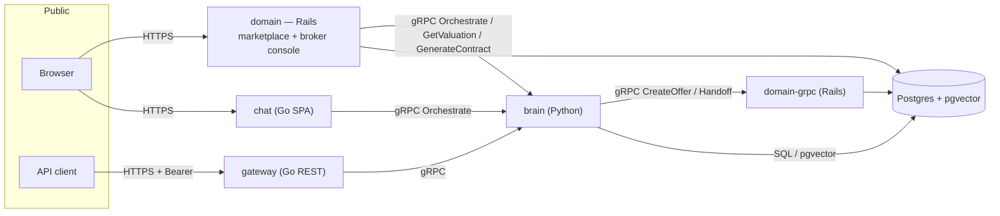
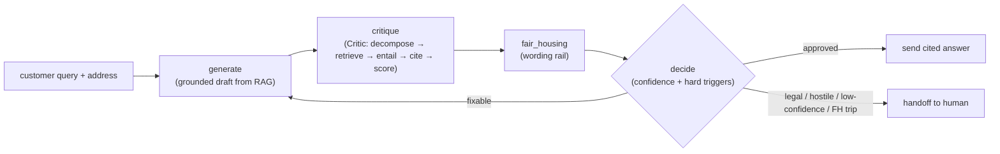

# AI Real Estate Agent (Austin) — an agent that shows its work

A two-sided autonomous AI real-estate agent for the Austin market, in the spirit
of an Opendoor-style iBuyer. It runs a **traditional listing marketplace** —
browse, filter, and compare homes — with the agent embedded as a **context-aware
sidebar**: it reasons over property data to value homes, helps buyers and
sellers, drafts TREC paperwork up to a licensed-broker gate, and — crucially —
**verifies every claim against a source before it says it**, routing anything it
can't stand behind to a human.

The product thesis: in real estate a hallucination is a lawsuit, so the agent is
built as a **glass box**. It doesn't just answer; it shows the reasoning — the
grounded draft, the per-claim fact-check with citations, the Fair Housing
wording rail, the confidence score, and the human-handoff decision.

---

## ▶ Try it (for reviewers)

| Surface | URL | What it is |
|---|---|---|
| **Consumer marketplace** | **https://are-domain.fly.dev** | The front door: browse/filter Austin listings, sign in (name + email), and use the **Buyer** and **Seller** workspaces with the agent sidebar — get a cited decision bundle, make an offer, or get a cash offer. **Start here.** |
| **Consumer chat ("the glass box")** | https://are-chat.fly.dev | A focused standalone view: ask about a home and watch the agent reason live — grounded answer, cited claims, Fair Housing rail, human handoff. |
| Broker console | https://are-domain.fly.dev/broker/dashboard | The human-in-the-loop back office: handoff queue + offers awaiting a broker's signature; **Sign & deliver contract** generates the TREC draft (HTTP basic auth). |
| Public REST API | https://are-gateway.fly.dev | `GET /valuation?address=` and `POST /orchestrate` (both need a Bearer token); `GET /health` is open. |

**Things to try** (they exercise the safety design, not just a happy path):

1. In a listing's sidebar, **"Is this home fairly priced vs nearby sales?"** → a grounded answer with a citation behind every figure.
2. **Make an offer** → a cited decision bundle (mortgage rate, comps, tax, monthly payment), then it routes to the broker queue — *not binding until a human signs*.
3. **"Add a custom indemnification clause to my contract."** → it refuses to draft legal language and routes to a licensed broker (a hard **UPL** trigger).
4. Ask about an unfamiliar address → **"no source → no claim"** fires: rather than invent a number, it hands off to a human.

> The stack runs on always-on Fly machines; if a service was scaled to zero to
> save cost, the first request wakes it (a few seconds). Everything is also
> runnable locally — see [Run it locally](#run-it-locally).

---

## Who it's for

| Actor | Need the agent serves |
|---|---|
| **Buyer** (A2) | Browse/compare listings, then a grounded, cited decision (rate/comps/tax/monthly) and a broker-routed purchase offer. |
| **Seller** (A1) | A fast, trustworthy cited valuation and a platform cash offer for an Austin home. |
| **Licensed broker / operator** (A4) | The human-in-the-loop. Reviews and *signs* offers (the agent never signs) — signing is what generates the contract — and takes over when the agent escalates. Works the broker console. |
| **The iBuyer business** | Throughput on the north-star metric — **time-to-offer** — without trading away legal/Fair-Housing safety. |
| **External transaction systems** (A5) | Escrow, title, lender — pinged at closing milestones (design present; see coverage). |

The product is **two-sided on one shared core**: buyer and seller workspaces (a
single signed-in identity holds both) reuse the same Brain, Lawyer, and offer
engine.

---

## The four pillars

- **🧠 Brain** — real-time per-address valuation (a gradient-boosting AVM), property RAG, and photo analysis. *"Reason over data, not static files."*
- **🗣 Voice** — conversation transport + intent triaging (high-intent buyer vs. browser). *Handles the messy human element.*
- **🤝 Closer** — drafts TREC promulgated-form paperwork (blanks only) within an authorized price band, up to a licensed-broker gate. Now reachable from the marketplace. *The autonomous principal — with guardrails.*
- **⚖️ Lawyer** — the load-bearing safety stack: a **Critic** that fact-checks every claim against source data (RAG), a **Fair Housing** wording rail, and **confidence-gated human-in-the-loop** handoff. *Hallucinations are lawsuits.*

---

## Architecture at a glance

Polyglot by design — the right language per job, one shared protobuf contract.

| Service | Lang | Role | Exposure |
|---|---|---|---|
| `services/domain` | Rails | **Consumer marketplace** (`/`: listings, buyer/seller workspaces, agent sidebar, contracts) **+ broker console** (`/broker`); leads/properties/offers, append-only audit, Domain gRPC | **public** |
| `services/gateway` | Go | Public REST edge; auth (HMAC bearer) + fan-out to gRPC | **public** |
| `services/chat` | Go | Standalone consumer "glass box" chat UI (embeds the SPA) | **public** |
| `services/brain` | Python | Valuation, vision, RAG, Lawyer (Critic + Fair Housing + HITL), **LangGraph orchestrator**, **Closer** (TREC) | internal |
| `services/ingestion` | Go | Travis County GIS + TCAD loaders; swappable `ListingSource` | internal |
| `services/voice` | Go | Conversation transport + intent qualification | internal |



The agent's turn is a **LangGraph** loop that makes the glass box possible:



`proto/` is the single source of truth; stubs are generated into
`proto/gen/go` and `services/brain/src/genproto` (and Ruby `lib/grpc`) via
`make proto`. **Full detail in [`docs/ARCHITECTURE.md`](docs/ARCHITECTURE.md).**

---

## How it stays safe (the part reviewers should look at)

- **No source → no claim.** The Critic decomposes every draft into atomic claims, retrieves provenance-tagged evidence per claim, and labels each `entailed` / `contradicted` / `baseless`. Unsupported claims are *stripped*; a contradicted claim *blocks and escalates*. Only cited claims are ever sent. The marketplace applies the same rule to its own numbers — comps/valuation it can't source are not invented.
- **Fair Housing wording rail.** A deny-list of protected-class terms + coded steering proxies ("good schools", "family-friendly", "safe neighborhood") scans every outgoing message; a trip blocks and routes to a human — output is never silently dropped.
- **UPL boundary (the agent does not practice law).** The Closer fills *promulgated TREC form blanks only* — it structurally cannot author clause language. A request for custom wording raises `UplViolation` and escalates; a licensed human broker reviews and **signs** (the agent never signs).
- **Human-in-the-loop triggers.** Hard, non-model-adjustable triggers (legal/UPL, high-dollar, hostile/distressed sentiment, explicit human request, Fair Housing trip) force a handoff *regardless of confidence*; a low composite-confidence score escalates as a soft trigger. Every buyer/seller offer lands `awaiting_broker` and is not binding until a broker signs.
- **Confidence is honest about itself.** The composite score (retrieval coverage + verifier agreement + self-consistency) is labelled **uncalibrated** in the UI and the code — an ordinal trust signal, not a probability.

---

## Requirements coverage (honest self-assessment)

Built against a four-pillar spec. The candid status — a feature *existing in code*
is not the same as it being *reachable by a user*:

✅ done & reachable · 🟡 built but **not reachable** (works in tests, no user/API surface) · 🟠 partial / synthetic · ❌ missing

| Pillar | Requirement | Status |
|---|---|---|
| Consumer | Browse / filter / compare listings (with photos) | ✅ reachable — the marketplace (20 curated sample listings) |
| Consumer | Buyer decision bundle (rate / comps / tax / monthly), cited | ✅ reachable — each figure sourced; no fabricated comps |
| Consumer | Buyer offer → broker queue | ✅ reachable — lands `awaiting_broker`, not binding until signed |
| Consumer | Seller valuation + platform cash offer, cited | ✅ reachable — live AVM, no-fabrication on insufficient data |
| Brain | Real-time per-address valuation (AVM) | ✅ reachable; 🟠 synthetic-trained, not live last-24h market data |
| Brain | Multi-source ingestion (MLS + TCAD + news) | 🟠 TCAD/GIS + synthetic MLS; **news ingestion ❌** |
| Brain | Visual property analysis (photos) | 🟡 real design (Gemini structured output), model unbound + unexposed in prod |
| Voice | Intent triaging (looky-loo vs high-intent) | ✅ real logic (voice service); voice app not deployed |
| Voice | Omnichannel (voice + SMS + email, one thread) | 🟠 voice session only; **SMS/email ❌** |
| Voice | Dynamic scheduling (calendars) | ❌ missing |
| Closer | TREC document generation (blanks-only, UPL-safe) | ✅ reachable — `Closer.GenerateContract` RPC; broker-sign delivers the draft in-app |
| Closer | Automated negotiation within a price band | 🟠 band guardrail real (single-pass, no counter loop); `Negotiation` model unused |
| Closer | Closing orchestration (escrow/title/lender pings) | 🟡 built; real sink raises `NotImplementedError`; not wired |
| **Lawyer** | **Fair Housing compliance** | ✅ reachable — runs every turn |
| **Lawyer** | **Truth-verification (Critic/RAG)** | ✅ reachable — every turn (deterministic entailer; real-LLM deferred) |
| **Lawyer** | **HITL handoff triggers** | ✅ reachable — legal / human-request handoffs + every offer broker-gated |

**Bottom line:** the entire **Lawyer** pillar, per-address valuation, the full
**buyer/seller journey**, and the **Closer's** TREC paperwork are now met and
reachable in the live marketplace — including the previously-unreachable Closer,
now exposed via `Closer.GenerateContract`. Still open: negotiation *counter*
loops and closing orchestration (built, unwired), and news ingestion, SMS/email,
and scheduling (genuinely unbuilt).

---

## Repo layout

```
proto/                 shared protobuf contract (single source of truth) + generated stubs
services/
  domain/    (Rails)   consumer marketplace (listings, buyer/seller workspaces, agent sidebar,
                       contracts) + broker console + leads/properties/offers, append-only audit, Domain gRPC
  gateway/   (Go)      public REST edge, HMAC auth, /valuation + /orchestrate
  chat/      (Go)      standalone consumer chat SPA (embedded) + /api/chat
  brain/     (Python)  valuation · vision · rag · lawyer (critic/fair_housing/handoff) · orchestrator · closer
  ingestion/ (Go)      TCAD + GIS loaders, ListingSource
  voice/     (Go)      conversation transport + intent qualification
deploy/fly/            per-service fly.toml, deploy.sh, DEPLOY.md (8-app topology, 3 public)
docs/
  ARCHITECTURE.md      system design, trust boundaries, data flow, deployment
  brainstorms/         requirements (actors, flows, R-IDs)
  plans/               implementation plans (MVP + the consumer-marketplace plan)
scripts/               gen-proto.sh, smoke.sh
```

---

## Run it locally

```bash
make proto       # regenerate gRPC stubs (Go + Python + Ruby)
make test        # Go + Python unit tests
make smoke       # cross-language gRPC round-trip (gateway -> brain)
make up          # full stack via docker compose (Postgres+pgvector + all services)
```

Full stack in one command:

```bash
GATEWAY_AUTH_SECRET=$(openssl rand -hex 32) docker compose up --build
```

The consumer marketplace against the brain (Rails + Python, no Docker):

```bash
# terminal 1 — the Python brain (gRPC)
cd services/brain && PYTHONPATH=src BRAIN_BIND=127.0.0.1:50151 python -m brain.server
# terminal 2 — the Rails marketplace, pointed at the brain
cd services/domain && BRAIN_ADDR=127.0.0.1:50151 bin/rails db:prepare db:seed && \
  BRAIN_ADDR=127.0.0.1:50151 bin/rails server
# open http://localhost:3000  (broker console at /broker/dashboard)
```

Or just the standalone glass-box chat:

```bash
PORT=8090 BRAIN_ADDR=127.0.0.1:50151 go run ./services/chat   # open http://localhost:8090
```

Local host ports (compose): gateway `8080`, brain `50051`, domain `3000`,
domain-grpc `50052`, db `5434` (avoids local 5432/5433 conflicts). The brain
warms its AVM + orchestrator at startup, so the first request may take a moment.

---

## Deploy (Fly.io)

Per-service configs, a deploy script, and a full runbook live in `deploy/fly/`.
Eight apps share one private network; **three** are public — the consumer
**marketplace** (`are-domain`), the REST **gateway**, and the **chat** app —
everything else is reachable over `*.flycast`.

```bash
export POSTGRES_PASSWORD=$(openssl rand -hex 24)
export RAILS_MASTER_KEY=$(cat services/domain/config/master.key)
export GATEWAY_AUTH_SECRET=$(openssl rand -hex 32)
export BROKER_DASHBOARD_USER=broker BROKER_DASHBOARD_PASSWORD=$(openssl rand -hex 16)
deploy/fly/deploy.sh        # creates apps, allocates IPs, stages secrets, deploys in order
```

See [`deploy/fly/DEPLOY.md`](deploy/fly/DEPLOY.md) for the topology, every secret,
and verification commands.

---

## What's real vs. synthetic (so reviewers aren't surprised)

- The **valuation model** is a real gradient-boosting regressor, but trained on a
  **hermetic synthetic dataset** (deterministic, no live MLS feed).
- The **RAG / Critic** pipeline is real; the entailer in the deployed path is a
  deterministic token-overlap implementation (a real-LLM entailer is dependency-injected and deferred).
- **Vision** is wired to Gemini structured output but runs against a fake unless a `GEMINI_API_KEY` is provided.
- **Marketplace listings** are a curated static sample of ~20 real Austin addresses with sample imagery (provenance-labeled), seeded once — not a live MLS feed. Mortgage/tax rates are dated, sourced reference values, not live quotes.

This is an assessment-grade system with production-shaped architecture — the
seams (real embedder, real entailer, live MLS feed, real closing sink) are
dependency-injected and documented, not hand-waved.

---

## Status

Two-sided MVP built across Go/Python/Rails, deployed live on Fly.io. The
LangGraph orchestrator is exposed end-to-end through the consumer **marketplace**
(agent sidebar) and **chat** app and the gateway `/orchestrate` API; the Closer's
TREC paperwork is reachable via `Closer.GenerateContract`. Tests: Go green,
Python brain **190** passing, Rails **141** passing. See `docs/ARCHITECTURE.md`
for design and `docs/plans/` for the plans and remaining deferred seams.
