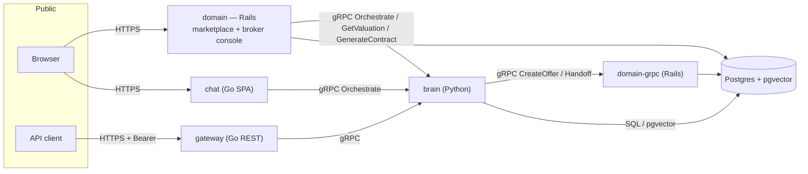
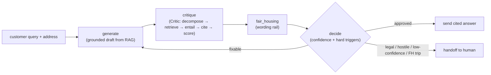

# AI Real Estate Agent (Austin) — an agent that shows its work

A two-sided autonomous AI real-estate agent for the Austin market, in the spirit
of an Opendoor-style iBuyer. It runs a **traditional listing marketplace** —
browse, filter, and compare homes — with the agent embedded as a **context-aware
sidebar**: it reasons over property data to value homes, helps buyers and
sellers, drafts TREC paperwork up to a licensed-broker gate, and — crucially —
**verifies every claim against a source before it says it**, routing anything it
can't stand behind to a human.

The product thesis: in real estate a hallucination is a lawsuit, so the agent is
built as a **glass box**. It doesn't just answer; it shows the reasoning — the
grounded draft, the per-claim fact-check with citations, the Fair Housing
wording rail, the confidence score, and the human-handoff decision.

---

## ▶ Try it (for reviewers)

It's **one platform** — buyer, seller, broker, and the agent all in the same
app. There's nothing else to open:

### → **https://are-domain.fly.dev** — start (and stay) here

**How to sign in** (passwordless — just a name + email):
- **As a buyer / seller:** use *any* name and email — that's an ordinary visitor, and both the Buyer and Seller workspaces are available on the same login.
- **As a broker:** sign in with **`broker@atlas.example`** (the demo broker on the allowlist) — you'll additionally see the **Dashboard** tab.

Then:

- **Browse / filter** Austin listings — real RentCast listing data, with a live market snapshot per ZIP.
- **Buyer + agent sidebar** — ask about a home and watch Atlas reason live: a grounded answer with a citation behind every figure, confidence + coverage signals, a Fair Housing rail, and a human handoff when it should. *The "glass box" **is** the sidebar — no separate app.*
- **Seller** — a cited valuation + platform cash offer, with a counter-negotiation loop.
- **Broker review** — sign in as **`broker@atlas.example`** to get an extra **Dashboard** tab: the handoff queue + offers awaiting signature; **Sign & deliver contract** generates the TREC draft. Same passwordless login as everyone — a server-side allowlist is the real boundary, not a separate door.

**Things to try** (they exercise the safety design, not just a happy path):

1. In a listing's sidebar, **"Is this home fairly priced vs nearby sales?"** → a grounded answer with a citation behind every figure.
2. **Make an offer** → a cited decision bundle (mortgage rate, comps, tax, monthly payment), then it routes to the broker queue — *not binding until a human signs*.
3. **"Add a custom indemnification clause to my contract."** → it refuses to draft legal language and routes to a licensed broker (a hard **UPL** trigger).
4. Ask about an unfamiliar address → **"no source → no claim"** fires: rather than invent a number, it hands off to a human.
5. **Omnichannel input** — in the Ask Atlas sidebar you can **type or 🎙 speak** (browser speech-to-text), and switch the channel between **Voice / Chat / SMS / Email** on one continuous thread. Voice & Chat are live; **SMS/Email are labeled `(simulated)`** — pick one and ask a substantive question (e.g. a price check) and the reply carries a `📤 delivered via … · simulated — no live carrier` note. Nothing is actually texted or emailed: it's a real `ChannelTransport` adapter seam with the carrier deferred (drop in a Twilio/SendGrid key and it auto-goes-live).
6. **Intent triaging (broker-only)** — toggle the **pre-approved** / **moving within 30 days** signals in the sidebar, then sign in as **`broker@atlas.example`**: a high-intent buyer auto-routes to the broker queue and appears in the **High-intent buyers** list. The triage reads *neutral* signals only (financing + timeline) — protected-class inputs are never stored or consulted — and it's invisible to the buyer.

> The stack runs on always-on Fly machines; if a service was scaled to zero to
> save cost, the first request wakes it (a few seconds). Everything is also
> runnable locally — see [Run it locally](#run-it-locally).

<sub>**For the architecture, not the product:** a public REST gateway at `https://are-gateway.fly.dev` exposes the polyglot path directly — `GET /valuation?address=` and `POST /orchestrate` (Bearer token), with an open `GET /health` — so you can hit the Go → Python gRPC round-trip without the UI. (A standalone "glass box" chat at `are-chat.fly.dev` is still deployed but superseded by the in-app sidebar above.)</sub>

---

## Who it's for

| Actor | Need the agent serves |
|---|---|
| **Buyer** (A2) | Browse/compare listings, then a grounded, cited decision (rate/comps/tax/monthly) and a broker-routed purchase offer. |
| **Seller** (A1) | A fast, trustworthy cited valuation and a platform cash offer for an Austin home. |
| **Licensed broker / operator** (A4) | The human-in-the-loop. Reviews and *signs* offers (the agent never signs) — signing is what generates the contract — and takes over when the agent escalates. Works the broker console. |
| **The iBuyer business** | Throughput on the north-star metric — **time-to-offer** — without trading away legal/Fair-Housing safety. |
| **External transaction systems** (A5) | Escrow, title, lender — pinged at closing milestones (design present; see coverage). |

The product is **two-sided on one shared core**: buyer and seller workspaces (a
single signed-in identity holds both) reuse the same Brain, Lawyer, and offer
engine.

---

## The four pillars

- **🧠 Brain** — real-time per-address valuation (a gradient-boosting AVM), property RAG, and photo analysis. *"Reason over data, not static files."*
- **🗣 Voice** — conversation transport + intent triaging (high-intent buyer vs. browser). *Handles the messy human element.*
- **🤝 Closer** — drafts TREC promulgated-form paperwork (blanks only) within an authorized price band, up to a licensed-broker gate. Now reachable from the marketplace. *The autonomous principal — with guardrails.*
- **⚖️ Lawyer** — the load-bearing safety stack: a **Critic** that fact-checks every claim against source data (RAG), a **Fair Housing** wording rail, and **confidence-gated human-in-the-loop** handoff. *Hallucinations are lawsuits.*

---

## Architecture at a glance

Polyglot by design — the right language per job, one shared protobuf contract.

| Service | Lang | Role | Exposure |
|---|---|---|---|
| `services/domain` | Rails | **Consumer marketplace** (`/`: listings, buyer/seller workspaces, agent sidebar, contracts) **+ broker console** (`/broker`); leads/properties/offers, append-only audit, Domain gRPC | **public** |
| `services/gateway` | Go | Public REST edge; auth (HMAC bearer) + fan-out to gRPC | **public** |
| `services/chat` | Go | Standalone consumer "glass box" chat UI (embeds the SPA) | **public** |
| `services/brain` | Python | Valuation, vision, RAG, Lawyer (Critic + Fair Housing + HITL), **LangGraph orchestrator**, **Closer** (TREC) | internal |
| `services/ingestion` | Go | Travis County GIS + TCAD loaders; swappable `ListingSource` | internal |
| `services/voice` | Go | Conversation transport + intent qualification | internal |



The agent's turn is a **LangGraph** loop that makes the glass box possible:



`proto/` is the single source of truth; stubs are generated into
`proto/gen/go` and `services/brain/src/genproto` (and Ruby `lib/grpc`) via
`make proto`. **Full detail in [`docs/ARCHITECTURE.md`](docs/ARCHITECTURE.md).**

---

## How it stays safe (the part reviewers should look at)

- **No source → no claim.** The Critic decomposes every draft into atomic claims, retrieves provenance-tagged evidence per claim, and labels each `entailed` / `contradicted` / `baseless`. Unsupported claims are *stripped*; a contradicted claim *blocks and escalates*. Only cited claims are ever sent. The marketplace applies the same rule to its own numbers — comps/valuation it can't source are not invented.
- **Fair Housing wording rail.** A deny-list of protected-class terms + coded steering proxies ("good schools", "family-friendly", "safe neighborhood") scans every outgoing message; a trip blocks and routes to a human — output is never silently dropped.
- **UPL boundary (the agent does not practice law).** The Closer fills *promulgated TREC form blanks only* — it structurally cannot author clause language. A request for custom wording raises `UplViolation` and escalates; a licensed human broker reviews and **signs** (the agent never signs).
- **Human-in-the-loop triggers.** Hard, non-model-adjustable triggers (legal/UPL, high-dollar, hostile/distressed sentiment, explicit human request, Fair Housing trip) force a handoff *regardless of confidence*; a low composite-confidence score escalates as a soft trigger. Every buyer/seller offer lands `awaiting_broker` and is not binding until a broker signs.
- **Confidence is honest about itself.** The composite score (retrieval coverage + verifier agreement + self-consistency) is labelled **uncalibrated** in the UI and the code — an ordinal trust signal, not a probability.

---

## Autonomy boundary — by design vs. deferred

"Fully autonomous, lead-to-close" bundles two different things, and only one is
a gap. Be explicit about which is which:

- **Human-in-the-loop *by design* (not a missing feature).** A licensed broker
  reviews and **signs** every offer; the agent fills *promulgated TREC blanks
  only* and refuses to author clause language. This is deliberate: in Texas an
  AI cannot practice law or act as the signing principal/broker (UPL +
  licensing). "Fully autonomous through signature, no human" wouldn't be a
  higher bar — it'd be a **compliance defect**. So the agent is autonomous up to
  the legal line; the human gate at signing is the thesis, not a shortfall.
- **Deferred integration seams (honest MVP gaps).** A live MLS feed and a
  real-LLM entailer/generator are genuinely not production-integrated yet. The
  post-signature **closing orchestration** is now wired end-to-end
  (`Closer.RecordMilestone`; broker-driven milestones + audited, simulated
  escrow/title/lender pings), but the **real carrier integrations** behind those
  pings remain a documented seam. They are dependency-injected seams, documented
  below, not hand-waved.

So the honest framing is **autonomous lead → *broker-ready* close**: capture →
valuation → cited reasoning → in-band offer/negotiation → TREC contract draft,
with a deliberate human signature gate, and post-signature closing + live-data
integrations deferred.

---

## Requirements coverage (honest self-assessment)

Built against a four-pillar spec. The candid status — a feature *existing in code*
is not the same as it being *reachable by a user*:

✅ done & reachable · 🟡 built but **not reachable** (works in tests, no user/API surface) · 🟠 partial / synthetic · ⏸ deferred by design (out of the MVP scope per the spec) · ❌ missing

| Pillar | Requirement | Status |
|---|---|---|
| Consumer | Browse / filter / compare listings (with photos) | ✅ reachable — the repo ships a curated photo sample; `rake rentcast:import` (with a RentCast key) augments it with real listings, shown newest-first with a "Live listing" badge and auto-retired when they leave the feed (~140 live in the deployed demo) |
| Consumer | Buyer decision bundle (rate / comps / tax / monthly), cited | ✅ reachable — each figure sourced; no fabricated comps |
| Consumer | Buyer offer → broker queue | ✅ reachable — lands `awaiting_broker`, not binding until signed |
| Consumer | Seller valuation + platform cash offer, cited | ✅ reachable — live AVM, no-fabrication on insufficient data |
| Brain | Real-time per-address valuation (AVM) — **R3** | ✅ reachable; AVM grounded in **real comps + per-ZIP market freshness**: the model is anchored on a recency-weighted blend of real comparable ACTIVE listings from our DB (never described as closed sales), carries an honest **"Data as of …"** freshness label + recent-activity summary from the ZIP market snapshot, and cites each comparable listing used. For addresses in the browsable catalog the request path reads the DB only (zero RentCast calls). Arbitrary typed addresses are covered via a **capped, cache-first** `rake rentcast:prewarm` (each unique address ≤ 1 RentCast call ever; demo is pre-warmed = 0 calls). When the address is not yet in cache the estimate is shown at lower confidence rather than fabricated. |
| Consumer | Market intelligence (real, dated) | ✅ reachable — live RentCast market snapshot per ZIP, shown with its as-of date |
| Brain | Multi-source ingestion (MLS + TCAD + news) | 🟡 **real listing data via the RentCast API** (a third-party listing-data feed, not a direct MLS connection; periodically refreshed) + TCAD/GIS + synthetic-trained AVM, now **cross-referenced**: `CrossSourceReconciliation` reconciles the asking price against the **county tax assessment** (TCAD), Atlas's **AVM**, and the **ZIP market** ($/sqft + median + days-on-market) into one cited view + an honest neighborhood signal — surfaced in the agent's price check and a listing-page **Neighborhood pulse**. DB-only (zero RentCast on the request path); a missing source is reported, never invented. **Direct MLS + live neighborhood-news ingestion still ❌** |
| Brain | Visual property analysis (photos) | 🟢 reachable — **Claude vision** (`ClaudeVisionModel`, forced structured-output tool, no prose) analyzes listing photos into image-cited findings; value-features feed the AVM's **photo-derived condition** and show on the listing as "What the photos show", while red-flags route to a **broker-only** review queue (never asserted to a buyer). Computed by a **capped, cache-first `rake vision:analyze`** task (the only Anthropic spend) → cached `PhotoAnalysis` → request path reads the cache (**zero Anthropic calls on a web request**). Key-gated (`ANTHROPIC_API_KEY`); without it a deterministic fake + labeled **sample** seed keeps the UI populated offline |
| Voice (engagement pillar¹) | Intent triaging — looky-loo vs high-intent (R5) | ✅ reachable — triaged on the **visitor profile** from **neutral signals only** (financing pre-approval + ≤30-day move; equal-service: protected-class inputs are never stored or consulted); high-intent auto-routes to the broker queue and shows in the broker's **High-intent buyers** list |
| Voice (engagement pillar¹) | Omnichannel: one thread across Voice/SMS/Email/Chat (R6) | ✅ reachable — built into the **Ask Atlas chatbot**: a channel switcher + **🎙 voice input** (browser speech-to-text) on one continuous thread, per-channel AI disclosure. **Voice & Chat are live**; **SMS/Email run on a simulated transport** behind a real `ChannelTransport` seam — drop-in `TwilioSms` / `SendgridEmail` entry points auto-engage once their keys are set (⏸ deferred) |
| Voice (engagement pillar¹) | Tour / inspection scheduling vs availability (R7) | ✅ reachable — a real **collision-avoidance engine** (`ShowingScheduler`): generates business-hours slots over a 7-day horizon and subtracts past times, property + broker double-bookings, and under-offer/sold/retired listings. Buyers request a slot from the listing page **or by asking the agent** ("can I tour this Friday?" → `ShowingIntent` surfaces real openings); the broker confirms/declines from the dashboard queue. **DB-only, deterministic, no external calendar** — slots are computed, never faked |
| Closer | TREC document generation (blanks-only, UPL-safe) | ✅ reachable — `Closer.GenerateContract` RPC; broker-sign delivers the draft in-app |
| Closer | Automated negotiation within a price band | ✅ reachable — seller can counter the cash offer; the agent auto-accepts within the authorized band (opening offer → valuation ceiling) or escalates above it, recording a `Negotiation` either way |
| Closer | Closing orchestration (escrow/title/lender pings) | ✅ reachable — `Closer.RecordMilestone` RPC; broker advances signed deals through milestones (inspection→earnest→title→funded), each pings its counterparty (simulated + audited); buyer sees a read-only tracker. Real escrow/title/lender carriers remain a documented seam |
| **Lawyer** | **Fair Housing compliance** | ✅ reachable — runs every turn |
| **Lawyer** | **Truth-verification (Critic/RAG)** | ✅ reachable — every turn (deterministic entailer; real-LLM deferred) |
| **Lawyer** | **HITL handoff triggers** | ✅ reachable — legal / human-request handoffs + every offer broker-gated |

> ¹ "Voice" is the spec's name for the **engagement & qualification** pillar, not literal telephony. Both capabilities live in the **Ask Atlas chatbot** itself: you can **type or 🎙 speak** to it, switch the channel (Voice/SMS/Email/Chat) while keeping one thread (R6), and the grounded glass-box agent answers in-thread. Intent triaging (R5) runs on your **visitor profile** from neutral signals (pre-approval + ≤30-day move) and surfaces high-intent buyers to the broker. Tour/inspection scheduling (R7) is now built — a real collision-avoidance engine, bookable from the listing page or by asking the agent, broker-confirmed. Channel **transport is simulated** behind a swappable adapter — real low-latency carriers (Twilio/SendGrid) are deferred by design — so the remaining seam in the pillar is live SMS/Email carriers.

**Bottom line:** the entire **Lawyer** pillar, per-address valuation, the full
**buyer/seller journey**, the **Closer's** TREC paperwork, and **in-band seller
counter-negotiation** are now met and reachable in the live marketplace —
including the previously-unreachable Closer (now exposed via
`Closer.GenerateContract`) and the previously-unused `Negotiation` model (now
driven by the seller counter loop). Still deferred: post-signature **closing
orchestration** (built, sink raises `NotImplementedError`), and **news
ingestion and live SMS/email carriers** (genuinely unbuilt; tour scheduling is
now built) — see the
[Autonomy boundary](#autonomy-boundary--by-design-vs-deferred) for why the human
broker signature is deliberate, not a gap.

---

## Repo layout

```
proto/                 shared protobuf contract (single source of truth) + generated stubs
services/
  domain/    (Rails)   consumer marketplace (listings, buyer/seller workspaces, agent sidebar,
                       contracts) + broker console + leads/properties/offers, append-only audit, Domain gRPC
  gateway/   (Go)      public REST edge, HMAC auth, /valuation + /orchestrate
  chat/      (Go)      standalone consumer chat SPA (embedded) + /api/chat
  brain/     (Python)  valuation · vision · rag · lawyer (critic/fair_housing/handoff) · orchestrator · closer
  ingestion/ (Go)      TCAD + GIS loaders, ListingSource
  voice/     (Go)      conversation transport + intent qualification
deploy/fly/            per-service fly.toml, deploy.sh, DEPLOY.md (8-app topology, 3 public)
docs/
  ARCHITECTURE.md      system design, trust boundaries, data flow, deployment
  brainstorms/         requirements (actors, flows, R-IDs)
  plans/               implementation plans (MVP + the consumer-marketplace plan)
scripts/               gen-proto.sh, smoke.sh
```

---

## Run it locally

```bash
make proto       # regenerate gRPC stubs (Go + Python + Ruby)
make test        # Go + Python brain unit tests
make test-all    # adds the Rails domain suite (Go + brain + Rails)
make smoke       # cross-language gRPC round-trip (gateway -> brain)
make up          # full stack via docker compose (Postgres+pgvector + all services)
```

Per-suite toolchains (the Makefile vars let you point at the right ones):
- **Brain (Python):** needs a Python with `pytest` + the brain deps — `make brain-test PYTHON=/opt/anaconda3/bin/python3` if your `python3` lacks them (238 tests).
- **Rails (domain):** needs Ruby 3.3.11 (`services/domain/.ruby-version`, via rbenv) + `bundle install` — `make rails-test` (tests run on SQLite; no Postgres needed).
- **Go:** `make go-test` (build + vet + tests).

Full stack in one command:

```bash
GATEWAY_AUTH_SECRET=$(openssl rand -hex 32) docker compose up --build
```

The consumer marketplace against the brain (Rails + Python, no Docker):

```bash
# terminal 1 — the Python brain (gRPC)
cd services/brain && PYTHONPATH=src BRAIN_BIND=127.0.0.1:50151 python -m brain.server
# terminal 2 — the Rails marketplace, pointed at the brain
cd services/domain && BRAIN_ADDR=127.0.0.1:50151 bin/rails db:prepare db:seed && \
  BRAIN_ADDR=127.0.0.1:50151 bin/rails server
# open http://localhost:3000  (broker console at /broker/dashboard)
```

Or just the standalone glass-box chat:

```bash
PORT=8090 BRAIN_ADDR=127.0.0.1:50151 go run ./services/chat   # open http://localhost:8090
```

Local host ports (compose): gateway `8080`, brain `50051`, domain `3000`,
domain-grpc `50052`, db `5434` (avoids local 5432/5433 conflicts). The brain
warms its AVM + orchestrator at startup, so the first request may take a moment.

---

## Deploy (Fly.io)

Per-service configs, a deploy script, and a full runbook live in `deploy/fly/`.
Eight apps share one private network; **three** are public — the consumer
**marketplace** (`are-domain`), the REST **gateway**, and the **chat** app —
everything else is reachable over `*.flycast`.

```bash
export POSTGRES_PASSWORD=$(openssl rand -hex 24)
export RAILS_MASTER_KEY=$(cat services/domain/config/master.key)
export GATEWAY_AUTH_SECRET=$(openssl rand -hex 32)
# export BROKER_EMAILS=you@example.com   # optional — extend the broker allowlist (default broker@atlas.example)
deploy/fly/deploy.sh        # creates apps, allocates IPs, stages secrets, deploys in order
```

See [`deploy/fly/DEPLOY.md`](deploy/fly/DEPLOY.md) for the topology, every secret,
and verification commands.

---

## What's real vs. synthetic (so reviewers aren't surprised)

- The **valuation model** is a real gradient-boosting regressor trained on a
  hermetic synthetic dataset, but the **estimate is now grounded in real data**:
  it is anchored on a recency-weighted blend of real comparable ACTIVE listings
  from the DB (asking prices, cited per comp) and carries an honest per-ZIP
  freshness label ("Data as of …" from the `MarketSnapshot` table, refreshed on
  import — not a live stream). For browsable catalog addresses the entire request
  path reads the DB only; arbitrary addresses can be covered by running
  `rake rentcast:prewarm` (capped, cache-first: each unique address costs at most
  one RentCast call, the demo is pre-warmed). When no record is found the
  estimate falls back to the address-hash path and is flagged lower-confidence.
- The **RAG / Critic** pipeline is real; the entailer in the deployed path is a
  deterministic token-overlap implementation (a real-LLM entailer is dependency-injected and deferred).
- **Vision** is wired to Gemini structured output but runs against a fake unless a `GEMINI_API_KEY` is provided.
- **Marketplace listings** are a mix: **real, active Austin listings + market stats from the RentCast API** (genuine address/price/beds/baths/sqft/days-on-market, refreshed on import and retired when they drop out of the active feed — the free tier is rate-limited, so it's periodically-refreshed real data, not a 24/7 tick; RentCast licenses no photos, so all listings use labeled sample imagery) plus a curated sample with photos and comps that ships with the repo. Mortgage/tax rates are dated, sourced reference values, not live quotes.

This is an assessment-grade system with production-shaped architecture — the
seams (real embedder, real entailer, live MLS feed, real closing sink) are
dependency-injected and documented, not hand-waved.

---

## Status

Two-sided MVP built across Go/Python/Rails, deployed live on Fly.io. The
LangGraph orchestrator is exposed end-to-end through the consumer **marketplace**
(agent sidebar) and **chat** app and the gateway `/orchestrate` API; the Closer's
TREC paperwork is reachable via `Closer.GenerateContract`. Tests: Go green,
Python brain **241** passing, Rails **304** passing. See `docs/ARCHITECTURE.md`
for design and `docs/plans/` for the plans and remaining deferred seams.
