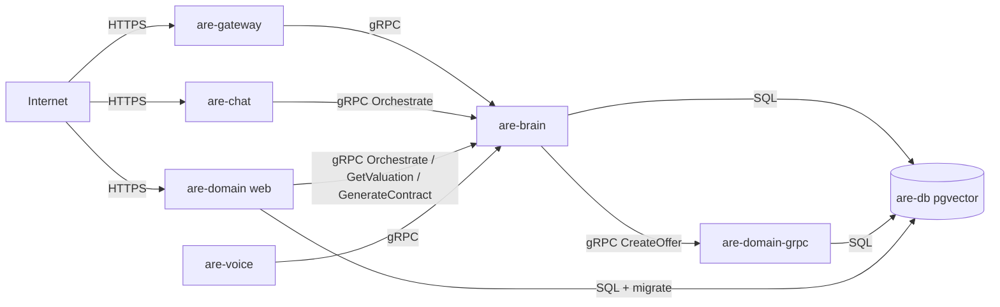

# Deploying to Fly.io

The AI Real Estate Agent deploys as **8 Fly apps** sharing one private network.
Three apps are public — the consumer **marketplace** (`are-domain`), the REST
gateway, and the consumer chat app; everything else is reachable internally over
`<app>.flycast`.

| App | Role | Exposure | Internal address |
|---|---|---|---|
| `are-domain` | Rails consumer marketplace (`/`) + broker dashboard (`/broker`, basic auth) + migrations | **public** | — |
| `are-gateway` | Public REST edge (auth'd) | **public** | — |
| `are-chat` | Standalone consumer chat UI (the "glass box" agent) | **public** | — |
| `are-brain` | Python gRPC (valuation, lawyer, RAG, orchestrator, closer) | private | `are-brain.flycast:50051` |
| `are-domain-grpc` | Rails Domain gRPC (CreateLead/Offer/Handoff) | private | `are-domain-grpc.flycast:50052` |
| `are-db` | Postgres + pgvector (RAG + Rails DBs) | private | `are-db.flycast:5432` |
| `are-ingestion` | Go data-loader worker (optional) | private | `are-ingestion.flycast:8081` |
| `are-voice` | Go conversation transport (optional) | private | `are-voice.flycast:8082` |



## Prerequisites

- `flyctl` installed and authed: `fly auth login`
- Docker running locally (Fly builds the images)
- App names are **globally unique** on Fly. If `are-*` is taken, rename the
  `app = "..."` line in each `deploy/fly/*.fly.toml` (and the `.flycast`
  references) to a unique prefix.

## Required secrets

Generate and export these before deploying. They are staged with
`fly secrets set --stage` and applied on each app's first deploy.

| Secret | Apps | How to generate |
|---|---|---|
| `POSTGRES_PASSWORD` | db, brain, domain, domain-grpc, ingestion | `openssl rand -hex 24` |
| `RAILS_MASTER_KEY` | domain, domain-grpc | `cat services/domain/config/master.key` |
| `GATEWAY_AUTH_SECRET` | gateway | `openssl rand -hex 32` |
| `GEMINI_API_KEY` | brain (optional) | from Google AI Studio; omit to keep vision on the fake model |
| `BROKER_DASHBOARD_USER` / `BROKER_DASHBOARD_PASSWORD` | domain (**recommended** — are-domain is public) | any user + `openssl rand -hex 16`; the broker dashboard at `/broker` enforces HTTP basic auth when set. When unset the dashboard has no login, so set them in production. Consumer routes + `/up` stay open. |

`DATABASE_URL` values are derived by `deploy.sh` from `POSTGRES_PASSWORD`
(RAG db `realestate`, Rails db `domain_production`) — do not set them by hand.

> The Rails `master.key` is gitignored. If `services/domain/config/master.key`
> is missing (fresh clone), regenerate credentials:
> `cd services/domain && EDITOR=true bin/rails credentials:edit` then use the
> printed key.

## Deploy

```bash
export POSTGRES_PASSWORD=$(openssl rand -hex 24)
export RAILS_MASTER_KEY=$(cat services/domain/config/master.key)
export GATEWAY_AUTH_SECRET=$(openssl rand -hex 32)
# export GEMINI_API_KEY=...        # optional
# export REGION=dfw ORG=personal   # optional overrides

deploy/fly/deploy.sh                # full core stack
# deploy/fly/deploy.sh ingestion voice   # add the optional workers later
# deploy/fly/deploy.sh gateway           # redeploy a single app
```

`deploy.sh` creates the apps, the Postgres volume, the flycast (private) IPs for
internal services, and **public IPs for `are-domain`, `are-gateway`, and
`are-chat`**; stages secrets; then deploys in dependency order: **db → domain
(runs migrations via `release_command`) → domain-grpc → brain → gateway →
chat**. Save your `POSTGRES_PASSWORD` — losing it means re-keying the database.

## Verify

```bash
GW=are-gateway.fly.dev                                     # default Fly hostname

curl -fs "https://$GW/health"                              # {"service":"gateway","status":"ok"}

# /valuation is auth'd. The token is an HMAC over GATEWAY_AUTH_SECRET, so mint it
# locally with the SAME secret you deployed (the Go image is distroless — no
# shell to ssh into):
TOKEN=$(GATEWAY_AUTH_SECRET="$GATEWAY_AUTH_SECRET" go run ./services/gateway -mint-token demo user)
curl -fs -H "Authorization: Bearer $TOKEN" \
  "https://$GW/valuation?address=123+Congress+Ave+Austin+TX"
# -> {"sufficient_data":true,"estimate":...,"facts":[...]}  (first call may take ~10s while the AVM warms)

# Consumer marketplace (public): the listing site is the root of are-domain.
curl -fsI "https://are-domain.fly.dev/"                    # 200 — browsable catalog
# Broker dashboard (public, HTTP basic auth) lives under /broker:
#   open https://are-domain.fly.dev/broker/dashboard  (user/pass = BROKER_DASHBOARD_*)
```

## Notes & decisions

- **Postgres is a plain pgvector container, not Fly Managed Postgres** — it
  guarantees the `vector` extension and creates both databases (`db-initdb/`).
  For HA/backups later, migrate to Fly Managed Postgres and point the
  `DATABASE_URL`s at it (pgvector must be enabled there).
- **Migrations** run once per deploy via `are-domain`'s `release_command`;
  `are-domain-grpc` never migrates (no multi-machine race).
- **Internal addressing uses `.flycast`** (private, load-balanced). If a name
  doesn't resolve, confirm the app has a private IP: `fly ips list --app <app>`
  (deploy.sh allocates them).
- **The brain trains its AVM at startup** and `min_machines_running = 1`, so it
  stays warm; the gateway's request timeout is 30s to cover a cold first call.
- **Cost**: ~6 shared-cpu-1x machines + one 3GB volume. Stop everything with
  `for a in are-db are-brain are-domain are-domain-grpc are-gateway are-chat are-ingestion are-voice; do fly scale count 0 --app $a --yes; done`.
- **`are-domain` is public** (the marketplace front door); `deploy.sh` allocates
  its public IPs alongside `are-gateway`/`are-chat`. Because the broker dashboard
  at `/broker` shares this app, set `BROKER_DASHBOARD_USER` /
  `BROKER_DASHBOARD_PASSWORD` so it enforces HTTP basic auth (`/up` and the
  consumer routes stay open). `are-domain` also needs `BRAIN_ADDR`
  (`are-brain.flycast:50051`, set in `domain.fly.toml`) for the agent sidebar,
  valuation, and the Closer contract draft.
