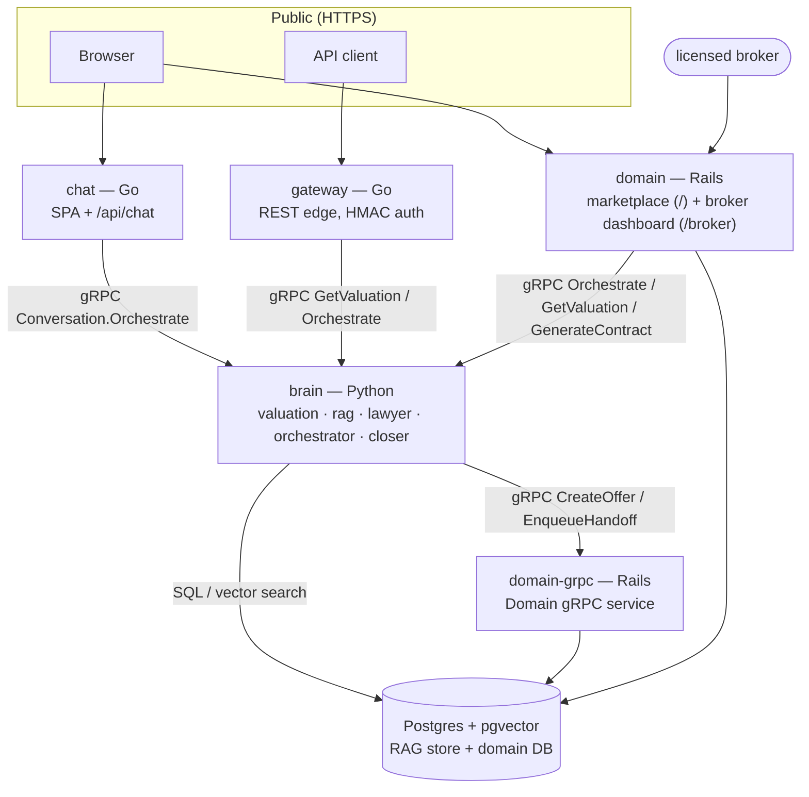
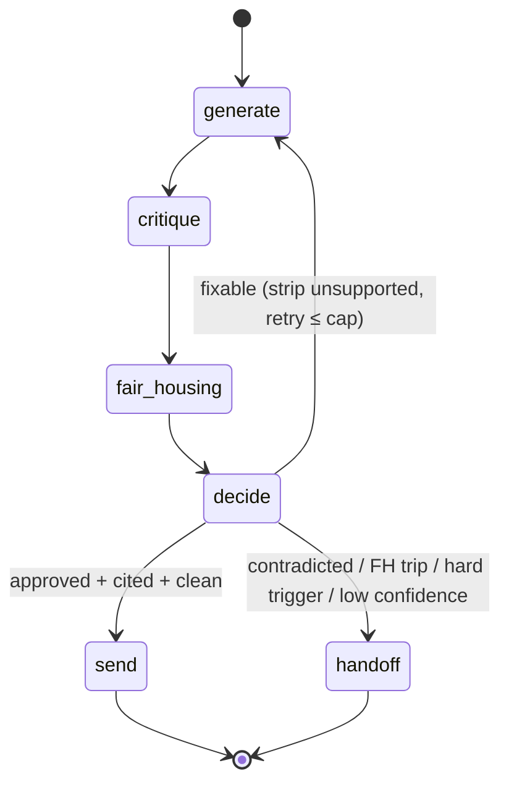
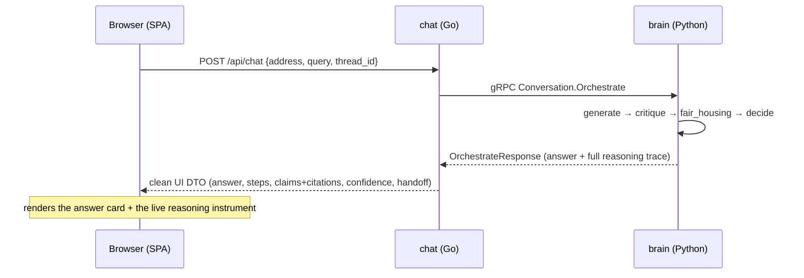
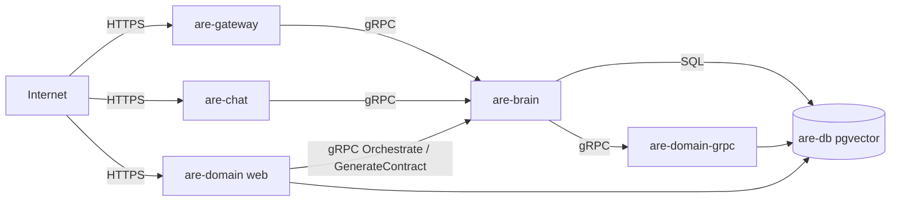

# Architecture

This document is the design reference for the AI Real Estate Agent. It explains
*why* the system is shaped the way it is, how a request flows end to end, where
the trust boundaries are, and what is real vs. deferred. For the product pitch
and how to try it, see the [README](../README.md).

---

## 1. Design goals & the central bet

The product is an Opendoor-style iBuyer agent for Austin: value a home, talk to a
seller/buyer, draft an offer, and close — autonomously, up to the points where a
human legally or commercially must be in the loop.

The central engineering bet is **verifiability over fluency**. A confidently
wrong statement in real estate ("this home is worth $X", "this neighborhood is
great for families") is a lawsuit or a Fair Housing violation. So the system is
designed so that:

1. **Every customer-facing claim is checked against a source before it is sent**
   (the Critic / "no source → no claim").
2. **The reasoning is inspectable** — the same trace the safety stack produces is
   surfaced to the UI (the "glass box"), not hidden behind a single answer.
3. **The autonomy has hard edges** — non-model-adjustable triggers force a human
   handoff regardless of how confident the model is.

Three cross-cutting decisions follow from that bet and recur throughout:

- **Dependency injection everywhere.** Every collaborator (embedder, entailer,
  store, handoff sink, offer sink, vision model) is injected. Tests run against
  deterministic fakes with zero network; production swaps in real implementations
  at the seam. This is what makes the system both hermetically testable and
  honestly incremental.
- **One protobuf contract across languages.** `proto/realestate/v1/realestate.proto`
  is the single source of truth; Go, Python, and Ruby stubs are generated from it.
- **A fixed verification pipeline separate from generation.** The Critic never
  writes; it only inspects a finished draft. Generation and verification are
  different concerns with different failure modes.

---

## 2. Why polyglot

The right tool per job, joined by the shared contract:

| Concern | Language | Why |
|---|---|---|
| Public edge, ingestion workers, conversation transport, the chat app | **Go** | Cheap concurrency, tiny static binaries, fast cold start at the network edge. |
| Valuation ML, RAG, the Lawyer stack, the LangGraph orchestrator | **Python** | The ML/agent ecosystem (scikit-learn, pgvector, LangGraph). |
| Transaction/CRM domain, audit, broker dashboard | **Rails** | Mature domain modeling, migrations, an admin UI for the human-in-the-loop. |

Services never share a database schema or in-process types — they communicate
only over gRPC defined by `proto/`. The polyglot split is a feature (clear
boundaries), not incidental.

---

## 3. System topology



**Public surfaces:** `gateway`, `chat`, and the consumer marketplace served by
`domain`. Everything else is private, reachable on the internal network
(`*.flycast` in production). The brain holds no public IP; it is reached only by
the authenticated gateway, the chat backend, or the marketplace's server-side
agent sidebar — all first-party gRPC clients on the internal network.

---

## 4. The polyglot contract

`proto/realestate/v1/realestate.proto` defines five services:

| Service | Served by | RPCs |
|---|---|---|
| `Valuation` | brain (Python) | `GetValuation` |
| `Verification` | brain (Python) | `VerifyMessage` |
| `Conversation` | brain (Python) | `Orchestrate` — runs one full agent turn, returns the whole reasoning trace |
| `Closer` | brain (Python) | `GenerateContract` — fills a promulgated TREC form (factual blanks only; a custom-clause request ⇒ UPL refusal + escalate) |
| `Domain` | domain (Rails) | `CreateLead`, `EnqueueHandoff`, `CreateOffer` |

`Conversation.Orchestrate` is the RPC that makes the glass box possible — its
response carries not just the answer but the per-claim verdicts + citations, the
confidence sub-signals, the Fair Housing decision, the handoff trigger, and a
pre-built step timeline.

Regenerate all stubs after editing the proto:

```bash
make proto    # -> proto/gen/go, services/brain/src/genproto, services/domain/lib/grpc
```

> Note: the Python stub step needs an interpreter that has `grpc_tools`
> installed (the brain's env). `make proto` handles this; if you run it by hand
> and see `No module named grpc_tools`, you've picked up the wrong `python3`.

---

## 5. The agent turn (orchestrator)

The heart of the system is a **LangGraph** state machine
(`services/brain/src/brain/orchestrator/graph.py`) wiring the independently-tested
units into one resumable loop:



- **generate** — values the address (the AVM), turns the valuation into
  provenance-tagged `Fact`s, ingests them into the RAG store, and composes a
  draft *only from those facts*. On a retry it regenerates from the Critic's
  already-supported claims.
- **critique** — the Critic (§7) verifies the draft claim-by-claim.
- **fair_housing** — the wording rail (§7) scans the draft.
- **decide** — composite confidence (§7) + hard-trigger detection (§7).
- **router** — `send` only if the Critic approved, the rail allowed, no hard
  trigger fired, and at least one supported claim exists; a *fixable* block
  (some claims survive, no contradiction, under the attempt cap) loops back to
  `generate` once; everything else is a `handoff`.

The state is a `TypedDict` threaded through the graph and persisted by a
checkpointer (`MemorySaver` by default, keyed by `thread_id` so a conversation
resumes; a `PostgresSaver` can be injected for restart durability without
touching node logic). The compiled graph is built **once per process** in the
brain and warmed at startup so the first call doesn't pay the build cost.

---

## 6. The "glass box" chat path



The chat backend is a first-party client of the internal mesh — like the
gateway, it calls the brain over gRPC. It reshapes the proto response into a
UI-friendly DTO (friendly source names instead of raw provenance ids; the
headline figure parsed out into a value card) and, on a handoff, composes a
candid "I'm routing you to a licensed human" message — it **never fabricates a
number**. The browser only ever talks to the chat backend.

---

## 7. The Lawyer: the safety stack

This is the load-bearing, fully-reachable part of the system. It is three
independent gates, by design — a claim can be perfectly true and still be an
illegal steering act, so factual verification and Fair Housing are *separate*.

### 7.1 Critic — truth verification (`lawyer/critic.py`)
A fixed pipeline, separate from any generator:
```
decompose → (per claim) retrieve evidence → entail → cite → score → gate
```
- Each atomic claim retrieves provenance-tagged evidence from the RAG store. No
  evidence ⇒ `BASELESS` ("no source → no claim").
- The entailer labels each claim `ENTAILED` / `CONTRADICTED` / `BASELESS`; an
  entailed claim binds a citation (the evidence `source_id`).
- Any contradicted or baseless claim, or a composite below threshold, **blocks**
  and **escalates**. Unsupported claims are stripped from a rebuilt
  `approved_message`; only cited claims can ever be sent.
- Output is a structured `VerificationResult` (per-claim verdicts + citations +
  audit rows) shaped to be written to the Rails audit table.

### 7.2 Fair Housing wording rail (`lawyer/fair_housing.py`)
A data-driven deny-list scanned over every outgoing message: the 7 federal
protected classes, the City of Austin ordinance additions, and coded steering
*proxies* ("good schools", "family-friendly", "safe neighborhood", "people like
you"). A trip returns `allowed=False, escalate=True` with a logged reason —
output is never silently dropped, it routes to a human. The term lists are data
(module-level tables), easy to extend without touching the scanner.

### 7.3 Confidence (`lawyer/confidence.py`)
A **composite, deliberately uncalibrated** score blending three orthogonal
signals: retrieval coverage (fraction of claims with a source), critic agreement
(entailed fraction × mean entailment score), and self-consistency (for
high-stakes claims). It is a severity-aware blend — a high agreement signal
cannot fully mask weak coverage. The code and UI both label it uncalibrated: an
ordinal trust signal, not a probability. Hard triggers override it.

### 7.4 HITL handoff (`lawyer/handoff.py`)
Two layers:
- **Hard, non-model-adjustable triggers** (deterministic detectors): legal/UPL
  (custom clause / legal-advice requests), high-dollar (binding commitment above
  a band), hostile/distressed sentiment, explicit human request, Fair Housing
  trip. Any one forces a handoff *even at high confidence*.
- **Soft trigger**: a composite confidence below the ops-tunable threshold.

On escalation, a `HandoffPacket` (trigger, score, reason, transcript, completed
steps, cited evidence, recommended action) is pushed to an injected sink — a fake
in tests, the Rails `Domain.EnqueueHandoff` gRPC in production — so the broker
dashboard has full, resumable context.

---

## 8. The Brain: valuation, RAG, vision

- **Valuation (`valuation/`)** — a gradient-boosting regressor over hedonic
  features (beds, baths, sqft, age, …), trained on a hermetic *synthetic*
  dataset at import. It returns a point estimate, an uncertainty band, and
  per-feature contributions; the orchestrator converts these into citable
  `valuation_run` facts. Real AVM ⇒ trained on first use ⇒ warmed at startup so
  the first request doesn't trip a client timeout.
- **RAG (`rag/`)** — `Fact`s carry a stable `source_id`, a `ProvenanceKind`
  (`tcad_appraisal`, `gis_attribute`, `listing_field`, `comp_sale`,
  `valuation_run`, `photo_finding`), content, and an address scope. The store is
  an `InMemoryVectorStore` (deterministic, hermetic) by default; `PgVectorStore`
  (import-safe, lazy-connecting) is the production swap. The embedder is a
  deterministic `FakeEmbedder` by default; a `RealEmbedder` is the injected seam.
- **Vision (`vision/`)** — a `PhotoAnalyzer` over a `VisionModel` protocol that
  routes findings into high-value features vs. red flags. The real
  implementation targets Gemini structured output; absent a `GEMINI_API_KEY` it
  runs the fake. Built and tested, not yet bound or exposed in production.

---

## 9. The Closer: paperwork & negotiation

`orchestrator/closer.py` drafts an offer under a licensed-broker gate:

- **TREC blanks only.** `FilledForm` (in `lawyer/trec_form.py`) has *no* free-text
  clause field by construction — it physically cannot carry authored language. A
  request for custom wording raises `UplViolation` and escalates. This is the UPL
  boundary as a type, not a guideline.
- **Authorized band.** `AuthorizedBand(open_price, ceiling)` guards the price:
  in-band ⇒ proceed; over the ceiling ⇒ escalate to a human (never auto-offered).
  This is the negotiation guardrail. On the seller side it is now wired into a
  **counter loop**: a seller counters the platform cash offer and the agent
  auto-accepts within the band or escalates above the ceiling, recording each
  counter as a `Negotiation`
  (`services/domain/app/services/negotiation_response.rb`).
- **Never signs.** A drafted offer is emitted with status `AWAITING_BROKER` and
  persisted via `DomainOfferSink → Domain.CreateOffer` into the Rails broker
  queue with its `form_json`. A licensed human reviews and signs in the dashboard.

The buyer side reuses the same Closer. **Now reachable:** the Closer is exposed
over the `Closer.GenerateContract` RPC (`services/brain/src/brain/closer_service.py`),
called by the Rails consumer marketplace when a broker signs an offer — it fills
the promulgated TREC form and the marketplace delivers the draft in-app to both
parties (with a Rails-side fallback fill if the brain is unreachable, so the flow
never dead-ends). The `Negotiation` Rails model is now wired through the seller
counter loop (above). Still unwired: the `ClosingOrchestrator` (milestone →
escrow/title/lender pings, `closing.py`) exists and is tested against fakes, but
its real sinks/flows are not yet connected.

---

## 10. The Domain (Rails) & the human-in-the-loop

`services/domain` owns the transactional truth: `Lead`, `Property`, `Offer`,
`Negotiation`, `AuditEvent`, `HandoffPacket`, `OfferMetric`, `Consent`. It runs
two processes from one image:

- **web** — the **consumer marketplace** at `/` (browsable Austin listings,
  lightweight visitor login, the Buyer and Seller workspaces, the context-aware
  agent sidebar that calls `Conversation.Orchestrate`, and broker-signed contract
  delivery) **and** the **broker dashboard** at `/broker/dashboard` (the HITL back
  office: handoff queue + offers awaiting signature), reached through the SAME
  consumer login and gated by a server-side broker allowlist. Sole DB migrator
  on boot.
- **grpc** — the `Domain` gRPC service (`CreateLead`, `EnqueueHandoff`,
  `CreateOffer`) the brain calls; waits for the web service's migration.

The audit log is append-only — it records *why* every escalation and offer
happened, with the Critic's per-claim rows, for compliance review.

---

## 11. Trust boundaries & auth

- **Gateway → callers.** The gateway mints/verifies short-lived HMAC-SHA256
  bearer tokens (`services/gateway/auth.go`). `/valuation` and `/orchestrate`
  require a valid token; `/health` and the API index are open.
- **Gateway/chat → brain.** Both dial the brain over gRPC on the private network.
  The brain currently does not enforce a server-side interceptor (it is
  network-isolated over flycast); the gateway still presents a service token, so
  tightening the brain to verify it is a drop-in.
- **Consumer marketplace.** Public at `domain`'s root `/`. A lightweight visitor
  login (name + email, no password) scopes the buyer/seller workspaces — a
  session identity for context, not a security boundary. The agent sidebar runs
  server-side, so the browser never reaches the brain directly.
- **Broker dashboard.** Path-scoped under `/broker` (not the root). Brokers use
  the SAME passwordless consumer login as everyone else; a `before_action
  :require_broker` admits only visitors whose email is on the broker allowlist
  (config `broker_emails`, extended by the `BROKER_EMAILS` env var) and redirects
  everyone else. The server-side check is the real boundary — the "Dashboard" tab
  is merely hidden for non-brokers, never the gate.

---

## 12. Deployment topology (Fly.io)

Eight apps, one private network, three public surfaces:



`are-ingestion` and `are-voice` are created but optional. All Go services build
from one `go.Dockerfile` (selected by a `SERVICE` build arg); the brain and
Rails images are per-service. Migrations run as a release/entrypoint step with a
single migrator. Full runbook, secrets, and per-app `fly.toml` in
[`deploy/fly/`](../deploy/fly/DEPLOY.md).

---

## 13. What's real, what's a seam

| Component | Status | Production seam |
|---|---|---|
| Valuation model | real model, **synthetic** training data | live MLS/feature pipeline |
| RAG store | real (`InMemoryVectorStore`) | `PgVectorStore` (present, lazy-connecting) |
| Embedder | deterministic `FakeEmbedder` | `RealEmbedder` (injected) |
| Entailer (Critic) | deterministic token-overlap | real-LLM entailer (injected) |
| Vision | real protocol + fake | Gemini structured output (needs key) |
| Handoff / offer sinks | fakes in tests | Rails gRPC (wired for offer/handoff) |
| Contract generation | real TREC fill | reachable via `Closer.GenerateContract` (wired to the marketplace) |
| Closing counterparty sink | fake | gRPC sink (`NotImplementedError` today) |
| Listings | real listings + market stats imported from the **RentCast API** — a third-party listing-data feed (aggregated active listings + market stats), not a direct MLS connection — via `rake rentcast:import` (source-labeled; seeded sample as offline fallback) | direct MLS provenance + listing photos behind `ListingSource` |
| Channel transport (SMS/Email) | **Voice & Chat are live** (in-browser); SMS/Email run on a `Simulated` transport behind the `ChannelTransport` adapter — the agent still replies in-thread and renders a `simulated` delivery note, but nothing is texted/emailed | drop-in `TwilioSms` / `SendgridEmail` classes auto-engage once `TWILIO_*` / `SENDGRID_API_KEY` are set (+ an inbound webhook for true two-way) |
| Intent triaging | real — `IntentTriage` qualifies a visitor (looky-loo vs high-intent) on the **profile** from a neutral allow-list (financing pre-approval + ≤30-day move); high-intent auto-routes to the broker queue | broaden signals / connect a CRM scoring model |

Every seam is dependency-injected and documented — the architecture is
production-shaped; the data and a few external integrations are deferred.

---

## 14. Testing strategy

- **Hermetic by default.** Fakes + in-memory stores + `MemorySaver` mean the
  whole agent loop runs with no network and no Postgres. The brain suite (197
  tests) covers valuation, RAG, the Critic, Fair Housing, confidence, handoff,
  the orchestrator (happy / critical / Fair-Housing / regenerate / resumability),
  the Closer, the closing orchestration, the demo spine, the `Conversation`
  servicer mapping, and the `Closer.GenerateContract` servicer (TREC fill +
  UPL-refusal path).
- **Cross-language smoke** (`make smoke`) exercises a real gateway → brain gRPC
  round-trip and returns a live valuation.
- **Rails** tests (196) cover the domain models and the full consumer marketplace, including the **Ask Atlas chatbot** omnichannel (channel switch + voice input + the `ChannelTransport` SMS/Email seam) and profile-based intent triaging
  — listings/search, the agent sidebar (DI fake brain), the cited decision bundle,
  the buyer/seller offer flows, contract generation + fallback, and the
  broker-gate lifecycle — against SQLite.

```bash
make test     # Go + Python
make smoke    # cross-language gRPC round-trip
```
