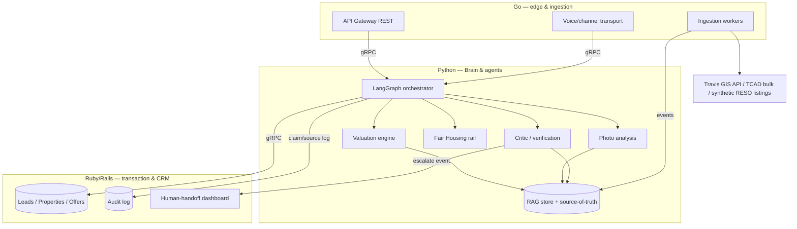
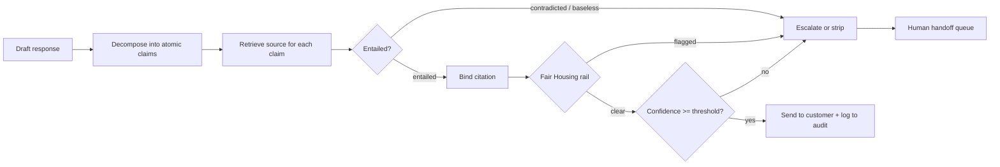
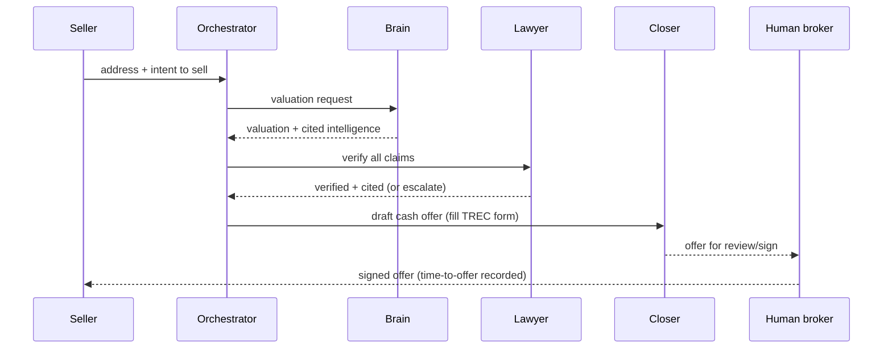

# feat: AI Real Estate Agent MVP — two-sided autonomous agent for Austin

## Summary

Build a two-sided autonomous AI real estate agent for Austin on one shared
core. Two deep pillars — a **Brain** (real-time valuation + property
intelligence over real public data and synthetic listings) and a **Lawyer**
(a Critic that verifies every customer-facing claim against source data, a
Fair Housing rail, and confidence-gated human handoff) — anchor a thin
**Closer** (TREC-form offer drafting under a licensed-broker gate) and a thin
**Voice** (single-channel conversation + qualification). Delivered in phases:
foundation/shared core first, then the seller-side cash-offer flow (shortest
path to *time to offer*), then the buyer-side flow, then the one-property
acquire→list→resell loop.

---

## Problem Frame

Traditional real estate runs on high-latency, person-to-person communication
over fragmented data, with a 5–6% commission attached. Elapsed time is direct
carrying cost. The opportunity is software that reasons over live-ish data and
*acts*, not just chats — but the binding constraint is trust: in real estate a
confident-but-wrong statement is a legal and financial liability, and offers /
negotiation are regulated brokerage acts. The product only ships if its claims
are grounded and its limits are enforced. This plan builds the grounded-and-
bounded core first (Brain + Lawyer), then layers thin transaction and
conversation surfaces onto it.

See origin: `docs/brainstorms/2026-05-29-ai-real-estate-agent-requirements.md`.

---

## Key Technical Decisions

- **Polyglot split along idiomatic seams (carries the origin's hard
  constraint).** Python owns the Brain (valuation/ML, vision) and the
  agent/LLM layer; Go owns the API gateway, the data-ingestion workers, and the
  Voice channel transport (concurrent, IO-bound, low-latency); Ruby/Rails owns
  the transaction + CRM domain, audit log, and human-handoff dashboard. This
  maps the required Go/Ruby/Python directly onto where each language is
  strongest (see origin Key Decision on the polyglot constraint).

- **gRPC + protobuf for internal sync calls; a message queue for events; REST
  only at the public edge.** A single shared protobuf schema is the polyglot
  contract across all three languages (first-class Go/Python/Ruby codegen).
  Events ("valuation requested", "offer accepted", "claim failed verification →
  escalate") decouple slow ML/agent work from the request path.

- **LangGraph for agent orchestration now; Temporal deferred but designed
  for.** LangGraph (Python) models the orchestrator → sub-agents → Critic loop
  as conditional edges with a Postgres checkpointer for resumability. Temporal
  (polyglot, durable) is the eventual owner of long-running transaction flows
  but adds infra cost; the Closer is designed so Temporal can own its flows
  later without a rewrite.

- **The Critic is a fixed pipeline: decompose → retrieve → entailment-label →
  cite → score → block/escalate.** Every customer-facing claim is decomposed
  into atomic claims, each checked for entailment against retrieved source
  facts, bound to a citation, and scored. *No source → no claim.* RAGAS
  faithfulness backs the score; a hard threshold (or any "contradicted" /
  Fair-Housing flag) routes to human handoff. Built as a LangGraph node
  separate from the generator. NeMo Guardrails supplies the fact-check rail;
  Guardrails AI validates structured offer outputs.

- **Fair Housing is a separate, non-negotiable output rail, not part of factual
  verification.** A deterministic deny-list + classifier blocks protected-class
  terms and known proxies ("safe", "good schools", "family-friendly",
  demographic descriptors); subjective neighborhood questions are redirected to
  neutral third-party sources rather than answered. Equal-service: identical
  qualification flow and listing sets regardless of inferred attributes.

- **Closer is autonomous up to a filled promulgated TREC form; a licensed
  human broker reviews and signs.** Texas law makes offers/negotiation licensed
  brokerage and limits non-attorneys to filling promulgated-form blanks (custom
  clause drafting is unauthorized practice of law). The system operates under a
  licensed broker entity with a designated human broker in the loop. This is
  the compliant reframing of the origin's "autonomous principal" — autonomy to
  the offer draft, human signature at the gate. *(Confirm structure with Texas
  counsel before any real pilot.)*

- **Data backbone: real Travis County GIS API + TCAD bulk records; synthetic
  MLS listings shaped to the RESO Data Dictionary, behind a swappable
  `ListingSource` interface.** Travis County GIS exposes programmatic
  parcel/attribute endpoints; TCAD appraisal data comes via a Public
  Information Request (bulk, not real-time). Synthetic listings are validated
  against ABoR's RESO developer reference server so a real Bridge/RESO feed
  drops in as a config change later.

- **Photo analysis emits structured, image-cited claims, never prose.** A
  vision model (Gemini, structured/function-calling output) returns a fixed
  JSON schema of value-features and red-flags with per-finding confidence and
  photo reference. Findings feed the AVM as inputs and flow through the Critic
  as image-cited claims; red flags route to human review.

- **Confidence is a composite signal, not a raw token probability.** Retrieval
  coverage + critic agreement + (for high-stakes claims) self-consistency,
  combined into a 0–1 score plus a reason. Hard-coded handoff triggers (legal
  complexity/UPL, high dollar value, hostile/FHA-sensitive sentiment, explicit
  "I want a human") sit above ops-tunable thresholds and are not model-
  adjustable.

- **Trust boundary: authenticate the edge and every service hop.** The public
  REST gateway enforces authenticated sessions + per-route authorization; all
  internal gRPC calls require mutual-TLS or signed service tokens so no service
  is reachable unauthenticated, and no caller can bypass the gateway to read
  leads/offers/PII directly. Secrets come from a secrets manager, never
  committed. The system holds consumer PII and financial deal terms, so this is
  a foundational control, not a later hardening step. (Built in U18.)

- **Groundedness is not accuracy or fairness — gate both explicitly.** The
  Critic guarantees a claim is *entailed by source data*, but entailment
  against synthetic comps or stale records does not prove the valuation is
  *correct* or *unbiased*. A separate accuracy gate measures error against real
  recorded sale prices, and a disparate-impact audit checks valuation outputs
  across neighborhoods and protected-class-correlated proxy features. Neither
  the "no unverified claims" guarantee nor the text-based Fair Housing rail
  substitutes for these — bias and inaccuracy live in the numbers, not the
  wording. (Built in U19.)

---

## High-Level Technical Design

### Service topology



### Per-message verification pipeline (the "Lawyer")



### Seller cash-offer flow (broker-gated)



---

## Output Structure

```text
ai-real-estate-agent/
  proto/                      # shared protobuf contracts (polyglot source of truth)
  services/
    gateway/                  # Go: public REST edge + gRPC fan-out
    ingestion/                # Go: Travis GIS / TCAD loaders, ListingSource interface
    voice/                    # Go: single-channel conversation transport
    brain/                    # Python: orchestrator, valuation, vision, critic, FH rail
      orchestrator/
      valuation/
      vision/
      lawyer/                 # critic + fair-housing + confidence/HITL
      rag/
    domain/                   # Rails: leads, properties, offers, audit, handoff dashboard
  data/
    synthetic/                # RESO-shaped synthetic listing generator + fixtures
  docs/
    brainstorms/
    plans/
```

The per-unit **Files** lists remain authoritative; the implementer may adjust
layout if implementation reveals a better shape.

---

## Requirements

Carried from the origin requirements doc (R-IDs preserved).

### The Brain — market intelligence (deep)

- R1. Real-time valuation for any Austin address.
- R2. Multi-source ingestion: real TCAD tax/appraisal + Travis County public
  records, synthetic MLS-style listings behind a swappable source, neighborhood
  signals.
- R3. Photo analysis identifying high-value features and red flags as grounded
  claims (subject to R11).
- R4. Valuation reflects recent market activity, not only static records.

### The Voice — engagement & qualification (thin)

- R5. Intent triaging (low-intent browser vs high-intent), both sides.
- R6. Coherent single-channel conversation with thread/context continuity,
  architected for additional channels later.
- R7. Propose/book tours or inspections without double-booking (thin).

### The Closer — transaction logic (thin)

- R8. Offer generation — seller cash acquisition offer + buyer TREC-style
  purchase-offer draft.
- R9. Negotiation within predefined financial guardrails (authorized band).
- R10. Closing-milestone orchestration with simulated escrow/title/lender
  counterparts.

### The Lawyer — safety & compliance (deep)

- R11. Critic verifies every customer-facing claim against source data (RAG)
  before send; unverifiable claims blocked, corrected, or escalated.
- R12. Never uses protected classes or proxies in reasoning or descriptions
  (Fair Housing).
- R13. Confidence scoring + human handoff on low confidence, hostile sentiment,
  or legal complexity.

### Cross-cutting

- R14. Seller and buyer flows share one core (Brain, offer engine, Lawyer); the
  same property can move acquire → list → resell.
- R15. Time-to-offer instrumented as the primary metric for both variants.
- R16. All access is authenticated and authorized — at the public edge and on
  every inter-service call; secrets are managed, never committed.
- R17. Valuation quality is gated before pilot: accuracy measured against real
  recorded sale prices, and a disparate-impact audit over valuation outputs
  across neighborhoods and proxy features.

---

## Implementation Units

Grouped into four phases. U-IDs are stable; phases are for sequencing clarity.

### Phase 1 — Foundation & shared core (Brain + Lawyer)

### U1. Repo scaffolding, polyglot skeleton, and shared protobuf contract

- **Goal:** Stand up the monorepo, all five service skeletons (Go gateway, Go ingestion, Go voice, Python brain, Rails domain) matching the Output Structure, the shared `proto/` contract, local dev orchestration (docker-compose), and CI.
- **Requirements:** Enables R14 (shared core).
- **Dependencies:** none.
- **Files:** `proto/`, `services/gateway/`, `services/ingestion/`, `services/voice/`, `services/brain/`, `services/domain/`, `docker-compose.yml`, CI config under `.github/workflows/`.
- **Approach:** Define the first protobuf services (Valuation, Verification, Domain) as the cross-language contract. gRPC codegen for Go/Python/Ruby. Rails app for the domain DB (Postgres). Postgres with `pgvector` for the RAG store. Git init + base README.
- **Patterns to follow:** none (greenfield); follow each language's conventional project layout.
- **Test scenarios:** `Test expectation: none -- scaffolding`. Add one smoke test per service that boots and answers a health check; one cross-language gRPC round-trip test (Go → Python) proving the shared contract compiles and serializes.
- **Verification:** All three services boot via docker-compose; a gRPC health call from gateway to brain succeeds; CI runs each language's test command green.

### U2. Data ingestion + swappable listing source (Go)

- **Goal:** Pull real Travis County GIS parcel/attribute data and load TCAD bulk appraisal records; generate RESO-Data-Dictionary-shaped synthetic listings behind a `ListingSource` interface.
- **Requirements:** R2, R4.
- **Dependencies:** U1.
- **Files:** `services/ingestion/gis_loader.go`, `services/ingestion/tcad_loader.go`, `services/ingestion/listing_source.go`, `data/synthetic/generator.go`, `services/ingestion/*_test.go`.
- **Approach:** GIS via the ArcGIS GeoServices/WFS endpoints; TCAD via a one-time bulk import of PIR-obtained records keyed on parcel/account number, joined to GIS geometry. `ListingSource` is an interface with `SyntheticListingSource` as the MVP implementation and a `BridgeRESOListingSource` stub for later. Emit normalized property records as events into the RAG/source store.
- **Patterns to follow:** Go interface-based provider pattern for the swappable source.
- **Test scenarios:** Happy path — GIS fetch for a known Travis parcel returns expected attributes; TCAD record joins to GIS geometry on account number. Edge — missing parcel, partial record, malformed GIS response. Synthetic — generated listings validate against the RESO Data Dictionary schema. Error — upstream timeout falls back/retries without crashing the worker.
- **Verification:** Ingestion populates the source store with joined real + synthetic property records; swapping `ListingSource` implementations requires no caller changes.

### U3. Valuation engine / Brain core (Python)

- **Goal:** Real-time AVM producing a cited valuation for any Austin address.
- **Requirements:** R1, R4.
- **Dependencies:** U2.
- **Files:** `services/brain/valuation/model.py`, `services/brain/valuation/service.py` (gRPC), `services/brain/valuation/features.py`, `services/brain/valuation/tests/`.
- **Approach:** Gradient-boosting AVM over TCAD + GIS + synthetic-listing features, with photo-derived condition (U4) as an optional feature. Output a valuation plus the feature contributions and source records that back it (for citation by the Critic). Expose over gRPC per the U1 contract.
- **Patterns to follow:** standard hedonic-baseline → gradient-boosting stack.
- **Test scenarios:** Covers R1. Happy path — known address returns a valuation in a plausible band with source-backed features. Edge — address with sparse data returns a wider/explicit-uncertainty result, not a false-precision number. Error — unknown address returns "insufficient data" rather than guessing. Integration — valuation output carries the source record IDs the Critic needs.
- **Verification:** Valuation API returns value + citations for seeded Austin addresses; sparse-data cases surface uncertainty.

### U4. Property photo analysis (Python)

- **Goal:** Extract value-features and red-flags from listing photos as structured, image-cited claims.
- **Requirements:** R3.
- **Dependencies:** U1.
- **Files:** `services/brain/vision/analyzer.py`, `services/brain/vision/schema.py`, `services/brain/vision/tests/`.
- **Approach:** Vision model (Gemini) with function-calling/structured output to a fixed JSON schema: `{feature|red_flag, confidence, evidence_photo_id, bbox?}`. No prose. Feed features into the AVM (U3) and emit findings as image-cited claims into the source store. Red flags below a confidence threshold route to human review rather than assertion.
- **Patterns to follow:** structured-output / function-calling discipline.
- **Test scenarios:** Covers R3. Happy path — a photo with granite counters yields a `granite_countertops` feature with photo reference. Edge — ambiguous image yields low confidence, not a confident claim. Error — corrupt/missing image handled gracefully. Red-flag — visible defect emits a red-flag finding routed to review.
- **Verification:** Analyzer returns schema-valid findings with per-finding confidence and photo references for a fixture image set.

### U5. RAG source-of-truth store + retrieval (Python)

- **Goal:** A retrievable, citation-bearing store of grounded facts (property records, comps, valuation outputs, photo findings) the Critic checks claims against.
- **Requirements:** Enables R11.
- **Dependencies:** U2, U3, U4.
- **Files:** `services/brain/rag/store.py`, `services/brain/rag/retriever.py`, `services/brain/rag/tests/`.
- **Approach:** `pgvector`-backed store; each fact carries a stable source ID and provenance (TCAD record, GIS attribute, listing field, comp sale, valuation run, photo finding). Retrieval returns candidate evidence with source IDs for claim entailment.
- **Patterns to follow:** retrieval-with-provenance.
- **Test scenarios:** Happy path — retrieving facts for an address returns source-tagged evidence. Edge — query with no matching source returns empty (drives "no source → no claim"). Integration — a valuation output written in U3 is retrievable as evidence here.
- **Verification:** Retrieval returns provenance-tagged evidence; absent-source queries return empty cleanly.

### U6. The Critic / verification rail (Python) — deep pillar

- **Goal:** Verify every customer-facing claim against source data before send.
- **Requirements:** R11.
- **Dependencies:** U5.
- **Files:** `services/brain/lawyer/critic.py`, `services/brain/lawyer/decompose.py`, `services/brain/lawyer/entailment.py`, `services/brain/lawyer/tests/`.
- **Approach:** LangGraph node, separate from the generator: decompose draft → retrieve per-claim evidence → label Entailed/Contradicted/Baseless → bind citation → score (RAGAS faithfulness backbone). Any "Contradicted"/"Baseless" or sub-threshold score blocks send and emits an escalate event. Integrate NeMo Guardrails fact-check rail; Guardrails AI validates structured outputs. Every claim→source decision logged to the Rails audit table (U9).
- **Execution note:** Implement the entailment/scoring contract test-first — it is the load-bearing safety guarantee.
- **Patterns to follow:** decompose → retrieve → entail → cite → score pipeline.
- **Test scenarios:** Covers AE1, R11. Happy path — a draft claim entailed by a TCAD record passes with a citation. Critical — an unsupported claim ("recently renovated" with no source) is blocked, not sent. Critical — a contradicted claim escalates. Edge — partially-supported multi-claim draft strips the unsupported claim, keeps the rest. Integration — a passing claim writes a claim→source row to the audit log.
- **Verification:** No claim reaches output without a citation or an escalation; audit log records every decision.

### U7. Fair Housing output rail (Python) — deep pillar

- **Goal:** Block protected-class steering in all consumer-facing output.
- **Requirements:** R12.
- **Dependencies:** U6.
- **Files:** `services/brain/lawyer/fair_housing.py`, `services/brain/lawyer/redirect_policy.py`, `services/brain/lawyer/tests/`.
- **Approach:** Deterministic deny-list + classifier covering the 7 federal protected classes, the Austin-ordinance additions, and known proxies ("safe", "good schools", "family-friendly", crime/demographic descriptors). Subjective neighborhood questions are redirected to neutral third-party sources, never answered with an opinion. Runs as an output rail before send; a trip escalates (it does not silently drop). Equal-service guarantee: no logic branches on inferred attributes.
- **Patterns to follow:** output-rail-before-send.
- **Test scenarios:** Covers AE2, R12. Happy path — neutral factual neighborhood answer (price, beds, commute) passes. Critical — "is this a safe/family-friendly neighborhood?" is redirected, not answered. Critical — output containing a protected-class proxy is blocked and escalated. Edge — school-quality/crime question redirected to third-party source per HUD steering guidance.
- **Verification:** Protected-class terms and proxies never appear in sent output; subjective questions are redirected; trips escalate with a logged reason.

### U8. Confidence scoring + HITL handoff (Python + Rails seam)

- **Goal:** Compute a composite confidence score and route exceptions to a human with full context.
- **Requirements:** R13.
- **Dependencies:** U6, U7, U9.
- **Files:** `services/brain/lawyer/confidence.py`, `services/brain/lawyer/handoff.py`, `services/brain/lawyer/tests/`.
- **Approach:** Composite score = retrieval coverage + critic agreement + (high-stakes) self-consistency, expressed 0–1 + reason. Hard-coded, non-model-adjustable triggers: legal complexity/UPL, high dollar value, hostile/FHA-sensitive sentiment, explicit human request. Above those, ops-tunable thresholds. On trigger, package a handoff packet (transcript, attempted action, completed steps, trigger + score + reason, retrieved evidence, recommended action) and push to the Rails handoff queue (U9).
- **Patterns to follow:** management-by-exception escalation.
- **Test scenarios:** Covers AE3, R13. Happy path — high-confidence grounded response proceeds without handoff. Critical — request for a custom contract clause forces handoff (legal trigger) regardless of confidence. Critical — hostile sentiment forces handoff. Edge — score just below threshold escalates with reason. Integration — handoff packet lands in the Rails queue with full context.
- **Verification:** Hard triggers always escalate; handoff packets carry resumable context; thresholds are config-driven.

### U9. Transaction/CRM domain, audit log, and handoff dashboard (Rails)

- **Goal:** The relational domain (leads, properties, offers, negotiation records), the immutable audit log, and the human-broker review/handoff dashboard.
- **Requirements:** Enables R8, R10, R11 (audit), R13 (handoff queue), R14.
- **Dependencies:** U1.
- **Files:** `services/domain/app/models/`, `services/domain/app/controllers/`, `services/domain/app/views/handoffs/`, `services/domain/spec/`.
- **Approach:** Rails domain models for lead/property/offer/negotiation; append-only audit table for claim→source decisions and rail trips; a broker-facing dashboard listing handoff packets and pending offers awaiting review/sign. Exposes domain over gRPC per U1.
- **Patterns to follow:** Rails fat-model/thin-controller; append-only audit.
- **Test scenarios:** Happy path — creating a lead/offer persists with associations. Edge — audit rows are immutable (no update/delete). Integration — a handoff event from U8 appears in the dashboard queue; an offer awaiting broker sign is listed.
- **Verification:** Domain CRUD works; audit log is append-only; handoff and offer-review queues render for the broker.

### U10. Orchestrator + agent wiring (Python / LangGraph)

- **Goal:** Wire the orchestrator → Brain/Closer/Voice sub-agents → Critic/Lawyer loop with resumable state.
- **Requirements:** R14.
- **Dependencies:** U3, U6, U7, U8.
- **Files:** `services/brain/orchestrator/graph.py`, `services/brain/orchestrator/state.py`, `services/brain/orchestrator/tests/`.
- **Approach:** LangGraph state graph with conditional edges for generate → critique → (send | escalate | regenerate), Postgres checkpointer for resumability. Structured so the Closer's longer flows can later migrate to Temporal without reworking the agent logic.
- **Patterns to follow:** LangGraph conditional-edge orchestration.
- **Test scenarios:** Happy path — a valuation query flows through Brain → Critic → send. Critical — a failed Critic check loops to escalate, never to send. Edge — interrupted run resumes from the checkpoint. Integration — orchestrator state survives a process restart.
- **Verification:** End-to-end query produces a verified, cited response or an escalation; runs resume after restart.

### U18. Service authentication & authorization

- **Goal:** Enforce authenticated, authorized access at the public edge and on every inter-service call; manage secrets.
- **Requirements:** R16.
- **Dependencies:** U1.
- **Files:** `services/gateway/auth.go`, `services/gateway/authz.go`, `services/brain/<svc>/interceptors.py`, `services/domain/app/controllers/concerns/authentication.rb`, gRPC token/mTLS interceptors per service, tests in each.
- **Approach:** Authenticated sessions (signed JWT/session) + per-route authorization at the Go gateway; mutual-TLS or signed service tokens on every gRPC call between gateway/ingestion/voice/brain/domain, rejecting unauthenticated peers so no caller can bypass the gateway to read leads/offers/PII. Secrets injected from a secrets manager / Docker secrets, never committed; CI secret-scanning gate.
- **Execution note:** Start with failing tests asserting unauthenticated REST and gRPC calls are denied.
- **Patterns to follow:** gateway-enforced authn + per-hop service identity.
- **Test scenarios:** Happy path — an authenticated request with a valid role reaches the resource. Critical — an unauthenticated REST call to the gateway is rejected. Critical — a direct gRPC call to brain/domain without a valid service token is rejected. Edge — expired/invalid token denied. Integration — a cross-service call carries and validates service identity end-to-end; no secret appears in the repo or built images.
- **Verification:** No REST or gRPC path is reachable without authentication; per-route authorization is enforced; secrets are absent from the repo and images.

### U19. Valuation accuracy & disparate-impact gates

- **Goal:** Prove the valuation is accurate against real prices and free of disparate impact before any pilot.
- **Requirements:** R17 (supports R1, R4, R12).
- **Dependencies:** U3.
- **Files:** `services/brain/valuation/accuracy_eval.py`, `services/brain/valuation/fairness_audit.py`, `services/brain/valuation/tests/`.
- **Approach:** Accuracy gate — measure valuation error (e.g., median error / MAPE) against a held-out set of **real Travis County recorded sale prices** (public deed records), kept separate from the synthetic-comps pipeline; the MVP may not claim valuation accuracy until the gate passes a stated target band. Disparate-impact gate — audit valuation outputs across neighborhoods and protected-class-correlated proxy features (location, GIS attributes) for systematic bias, since a text deny-list cannot catch bias encoded in prices; a detected disparity blocks the pilot. Both gates report results, not just a pass/fail flag, and write to the audit log.
- **Execution note:** Characterization-style — stand up the eval/audit harness and baseline metrics before tuning the model.
- **Patterns to follow:** held-out evaluation against ground-truth + fairness audit over model outputs.
- **Test scenarios:** Covers R12 (fairness). Happy path — the accuracy eval runs over the held-out real-sale set and reports error against the target band. Critical — the disparate-impact audit flags a neighborhood/proxy feature with systematically lower valuations and fails the gate. Edge — insufficient real-sale coverage reports low confidence rather than a passing grade. Integration — gate results are recorded to the audit log and surfaced on the dashboard.
- **Verification:** Valuation accuracy is measured against real recorded sales (not synthetic comps) and meets the target band; a disparate-impact audit runs over valuation outputs and gates the pilot; both results are logged.

### Phase 2 — Seller-side cash-offer flow (shortest path to time-to-offer)

### U11. Seller intake + qualification (Voice, thin)

- **Goal:** Single-channel conversation that captures a seller's address/intent and triages intent.
- **Requirements:** R5, R6.
- **Dependencies:** U10.
- **Files:** `services/voice/session.go`, `services/voice/qualify.go`, `services/brain/orchestrator/seller_intake.py`, tests in each.
- **Approach:** Go transport holds the channel session and thread continuity; the orchestrator runs qualification (high-intent seller vs browser) using only neutral, transaction-relevant facts (no protected-class proxies). Architected so additional channels attach to the same session contract.
- **Test scenarios:** Covers R5. Happy path — a seller providing address + timeline is qualified high-intent. Edge — vague inquiry stays low-intent without inventing data. Integration — session thread persists across multiple turns.
- **Verification:** Seller intake qualifies intent and hands a structured request to the orchestrator with thread continuity.

### U12. Seller cash-offer generation + broker gate (Closer, thin)

- **Goal:** Draft a cash acquisition offer by filling a promulgated TREC form from structured deal terms, routed to a licensed broker for review/sign.
- **Requirements:** R8, R9.
- **Dependencies:** U11, U6, U9.
- **Files:** `services/brain/orchestrator/closer.py`, `services/domain/app/models/offer.rb`, `services/brain/lawyer/trec_form.py`, tests in each.
- **Approach:** Populate promulgated-form blanks (price, dates, parties, property) only — never generate clause language (UPL). Negotiation stays within an authorized band (open vs ceiling); any out-of-band move or non-standard term forces handoff (U8). The drafted offer enters the Rails review/sign queue; a human broker signs.
- **Execution note:** Start with a failing test for the authorized-band guardrail and the UPL escalation boundary.
- **Test scenarios:** Covers AE4, R8, R9. Happy path — valid deal terms produce a filled TREC form awaiting broker sign. Critical — a request for a custom clause escalates (UPL), no clause generated. Critical — a counter above the ceiling never auto-offers; it escalates. Edge — counter within band is allowed. Integration — drafted offer appears in the broker review queue.
- **Verification:** Offers are form-filled within guardrails, never auto-signed, and custom-language requests escalate.

### U13. Time-to-offer instrumentation

- **Goal:** Measure time-to-offer for the seller cash-offer variant.
- **Requirements:** R15.
- **Dependencies:** U12.
- **Files:** `services/domain/app/models/offer_metric.rb`, `services/brain/orchestrator/metrics.py`, tests.
- **Approach:** Stamp lead-created → offer-drafted timestamps; expose the metric on the dashboard. Structured to add the buyer variant in Phase 3.
- **Test scenarios:** Covers R15. Happy path — a completed seller flow records a time-to-offer duration. Edge — an escalated/abandoned flow records no false completion. Integration — the metric surfaces on the dashboard.
- **Verification:** Time-to-offer is recorded and visible for seller flows.

### Phase 3 — Buyer-side flow (fast follow on the shared core)

### U14. Buyer qualification + property matching

- **Goal:** Qualify buyer intent and surface matching properties with cited intelligence.
- **Requirements:** R5, R6, R3 (photo intelligence in matches).
- **Dependencies:** U10, U3, U4.
- **Files:** `services/brain/orchestrator/buyer_intake.py`, `services/brain/orchestrator/matching.py`, tests.
- **Approach:** Reuse the Voice session contract (U11) and the Brain. Match on neutral criteria only; never branch on inferred attributes (equal-service). Surface valuation + photo findings as cited claims through the Critic and FH rail.
- **Test scenarios:** Covers R5. Happy path — a pre-approved buyer with criteria gets matches with cited intelligence. Critical — matching never uses protected-class proxies. Edge — over-constrained criteria returns "no matches", not fabricated ones.
- **Verification:** Buyer matches are neutral, cited, and verified before display.

### U15. Buyer purchase-offer draft + broker gate (Closer, thin)

- **Goal:** Draft a TREC purchase offer for a buyer through the same Critic + broker gate.
- **Requirements:** R8, R9, R15.
- **Dependencies:** U14, U12 (reuses Closer/broker gate).
- **Files:** `services/brain/orchestrator/closer.py` (extend), `services/domain/app/models/offer.rb` (buyer variant), tests.
- **Approach:** Same fill-promulgated-form + guardrail + broker-sign discipline as U12, on the buyer side. Extends time-to-offer instrumentation to the buyer variant (R15).
- **Test scenarios:** Covers AE4 (origin AE4 covers R9), R8. Happy path — buyer deal terms produce a filled purchase-offer awaiting sign. Critical — UPL/out-of-band moves escalate. Integration — buyer time-to-offer recorded.
- **Verification:** Buyer offers follow the same compliant gate; both time-to-offer variants record.

### Phase 4 — The loop, outreach compliance, and closing

### U16. One-property acquire→list→resell loop (demo spine)

- **Goal:** Demonstrate a single property moving acquire (seller) → list → resell (buyer) through the shared core.
- **Requirements:** R14.
- **Dependencies:** U12, U15.
- **Files:** `services/brain/orchestrator/loop.py`, `services/domain/app/models/property.rb` (lifecycle), tests.
- **Approach:** Property lifecycle state (acquired → listed → under-offer → sold); an acquired property (from a seller flow) becomes available to the buyer flow. No new agent logic — orchestration over existing units.
- **Test scenarios:** Happy path — a property acquired via the seller flow becomes matchable in the buyer flow and reaches "sold". Edge — lifecycle transitions are guarded (cannot list before acquired). Integration — the full loop runs end-to-end on one address.
- **Verification:** One property completes acquire → list → resell across both flows.

### U17. Consent-first outreach + AI disclosure + closing-milestone simulation

- **Goal:** Compliant outreach plumbing and simulated closing orchestration.
- **Requirements:** R10.
- **Dependencies:** U9, U10.
- **Files:** `services/voice/disclosure.go`, `services/domain/app/models/consent.rb`, `services/brain/orchestrator/closing.py`, tests.
- **Approach:** Contact only opted-in leads (consent record + opt-out/DNC handling); voice channel discloses AI in the first 30 seconds; voluntary AI disclosure in chat/SMS. Closing orchestration pings simulated escrow/title/lender counterparts as milestones are met (real integrations deferred behind interfaces).
- **Test scenarios:** Covers R10. Happy path — opted-in lead receives outreach with AI disclosure; milestone met triggers the right simulated ping. Critical — non-consented contact is blocked. Edge — opt-out immediately suppresses further outreach.
- **Verification:** Outreach is consent-gated and AI-disclosed; closing milestones trigger simulated counterpart pings.

---

## Scope Boundaries

### Deferred for later (carried from origin)

- Live, low-latency voice and live SMS/email gateways (MVP is single-channel).
- Live MLS feed and licensing (synthetic listings behind a swappable source).
- Real escrow / title / lender integrations and e-signature execution.
- Geographies beyond Austin.

### Outside this product's identity (carried from origin)

- A human-in-the-loop-by-default assistant. This is autonomous-first; humans
  are the exception path (R13) plus the legally-required broker sign-off, not
  the default operator.
- A generic real-estate CRM or a plain chatbot. The differentiator is grounded
  autonomy, not conversation volume.
- A replacement for licensed legal counsel; the Lawyer enforces guardrails and
  verification, it does not give legal advice.

### Deferred to follow-up work (plan-local sequencing)

- Temporal-backed durable transaction workflows (designed-for in U10/U12, not
  built in the MVP).
- Automated lead scoring/screening models (require a disparate-impact audit
  first; MVP qualifies on neutral facts only).
- Learned/auto-tuned escalation thresholds (MVP uses fixed conservative ones).
- Multi-sample self-consistency on every turn (MVP reserves it for high-stakes
  claims only).

---

## Risks & Dependencies

- **Texas brokerage licensing + UPL (highest-stakes).** Offers/negotiation are
  licensed brokerage; non-attorneys may only fill promulgated forms. The MVP
  assumes operation under a licensed broker entity with a designated human
  broker who reviews/signs, and AI limited to form-filling. *Confirm the exact
  structure and the negotiating-vs-ministerial line with Texas counsel before
  any real pilot.* Mitigation: U12/U15 hard-gate on broker sign and escalate
  any custom-clause request.
- **Fair Housing disparate-impact liability.** Intent isn't required; disparate
  impact counts, and a text deny-list cannot catch bias encoded in valuation
  *numbers*. Mitigation: U7 output rail + equal-service guarantee + full audit
  logging; **U19 disparate-impact audit over valuation outputs as a pilot gate**;
  automated lead scoring deferred pending audit.
- **Unauthenticated access to PII / offers.** The system holds consumer PII and
  financial deal terms across services. Mitigation: U18 authenticates the public
  edge and every inter-service gRPC hop, with managed secrets — no service is
  reachable unauthenticated.
- **TCAD data is not real-time and arrives via Public Information Request.**
  Verify PIR turnaround, format, fees, and whether appraisal values live in the
  GIS layer or require a join. Mitigation: U2 treats TCAD as a periodic bulk
  load joined to programmatic GIS data.
- **MLS access wall.** ABoR/Unlock MLS subscription is license-tied; real MLS
  may never be in scope. Mitigation: RESO-shaped synthetic behind a swappable
  source validated against the ABoR developer reference server.
- **Outreach compliance (SB 140 / TCPA).** Consent-first kills most
  registration burden; AI-voice disclosure required in first 30s. Mitigation:
  U17 consent gate + disclosure.
- **Model cost/latency** for per-message decompose→verify on every claim.
  Mitigation: reserve self-consistency for high-stakes claims; cache retrieval.

---

## Sources / Research

External research ran (greenfield repo, high-risk domain); it was load-bearing
for the KTDs above.

- Orchestration & durability: LangGraph vs CrewAI vs OpenAI Agents SDK
  comparison; Temporal for durable AI workflows (polyglot SDKs).
- Polyglot interop: gRPC/protobuf as cross-language contract; REST/gRPC/event
  messaging trade-offs.
- Verification: claim-decomposition + entailment + citation patterns; RAGAS
  faithfulness; NeMo Guardrails fact-check rail; Guardrails AI structured
  validation.
- Data: Travis County GIS Open Data (ArcGIS Hub) programmatic endpoints; TCAD
  Public Information Request path; Unlock MLS / ABoR RESO Web API via Bridge +
  RESO developer reference server.
- Vision: structured/function-calling output for grounded photo claims.
- Compliance: HUD AI/Fair Housing guidance (2024 + 2026 steering update); Texas
  Occupations Code Ch. 1101 (brokerage licensing); TREC promulgated-form / UPL
  line; Texas TRAIGA (HB 149); Texas SB 140 + federal TCPA for AI voice/SMS.
