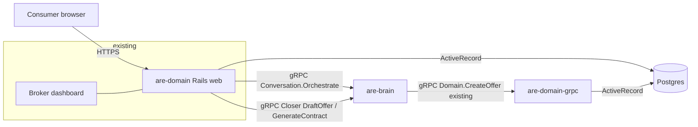
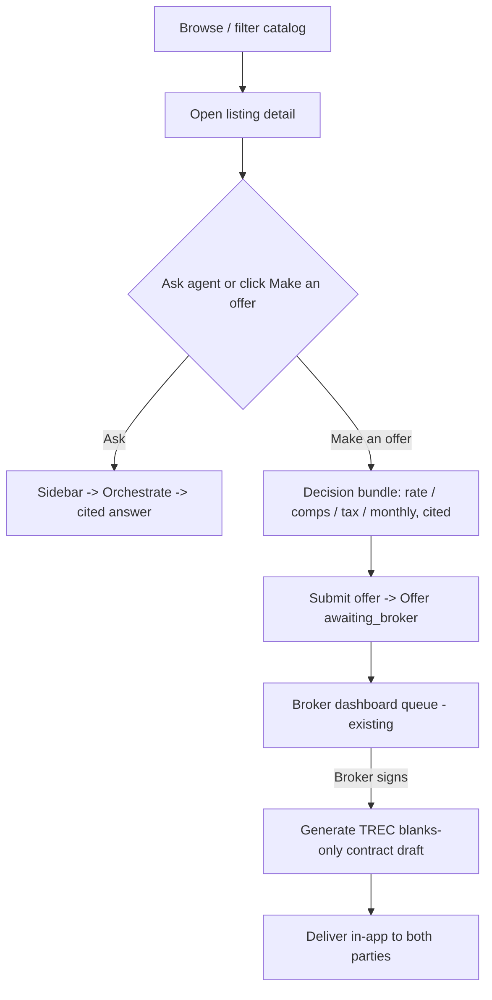
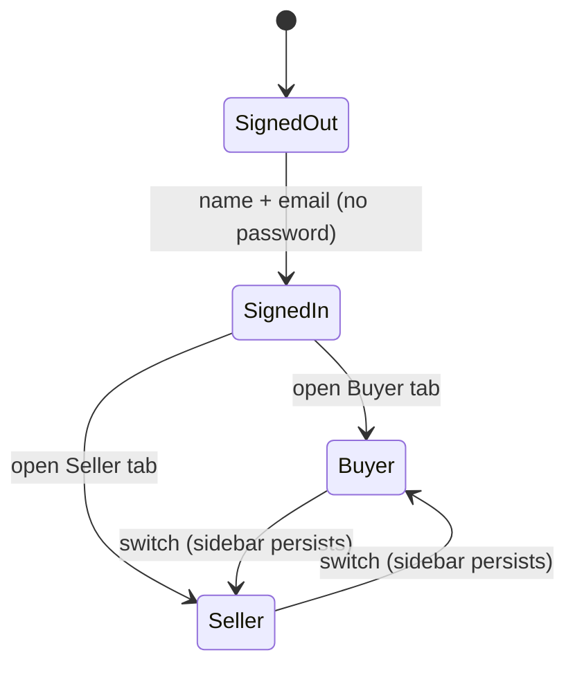

# feat: Consumer Marketplace with Agent Sidebar

## Summary

Build a traditional Austin real-estate browsing site — searchable by region and
price, with photos and comparison — inside the existing **Rails domain
service**, and embed the existing AI agent as a **persistent sidebar** in two
workspaces (Buyer and Seller) that one logged-in person uses in parallel. The
agent calls the existing `Conversation.Orchestrate` brain RPC for grounded,
cited reasoning; the buyer journey runs listing → cited decision bundle
(rate / comps / tax / monthly) → broker-routed offer → in-app contract draft;
the seller workspace reuses the existing valuation + Closer path. Every
agent-surfaced number carries a source.

---

## Problem Frame

The brain's reasoning, valuation, verification (Critic), paperwork (Closer), and
safety (Lawyer) capabilities exist but are reachable only through a JSON API, a
broker dashboard, and an agent-only chat SPA. A first-time consumer has no
familiar way to browse, filter, and compare homes — the baseline a real-estate
shopper expects before talking to an assistant. The capable backend therefore
reads as invisible. This plan restores the conventional listing-site surface in
the Rails service (which already owns the data models, Postgres, server-rendered
Hotwire stack, and the broker dashboard) and runs the agent *alongside* it as a
context-aware sidebar, not *instead* of it (see origin:
docs/brainstorms/2026-06-03-consumer-marketplace-agent-sidebar-requirements.md).

---

## Key Technical Decisions

- **Home = the Rails domain service (`services/domain`), extended not replaced.**
  It is the system of record (Property/Offer/Lead models, Postgres), already
  server-renders HTML via Propshaft + Hotwire (Turbo/Stimulus), and hosts the
  broker dashboard. The consumer marketplace is a new set of Rails namespaces
  alongside `broker/`. Avoids re-implementing an ORM/persistence layer in the Go
  chat service.

- **Listings = extend the existing `Property` model + a lightweight `Comp`
  model.** `Property` already models iBuyer inventory with a `listed` state and
  is the FK target of `Offer`. Add listing attributes (price, beds, baths, sqft,
  region, photo URLs, description, provenance) rather than introducing a parallel
  `Listing` model. `Comp` holds seeded nearby-sale references for the decision
  bundle.

- **Agent sidebar calls the brain directly from Rails over gRPC.** The brain's
  gRPC server runs `add_insecure_port` with **no auth interceptor** (verified in
  `services/brain/src/brain/server.py:196-201`) — flycast network isolation is
  the boundary, exactly as the chat service already relies on. Rails already
  bundles the `grpc` gem and generated stubs (`services/domain/lib/grpc/`), so a
  thin `Conversation` client mirrors the chat service. No service-token minting
  in Ruby.

- **Decision-bundle numbers are assembled Rails-side, each cited.** Mortgage rate
  and property-tax rate are dated static config values (with source + as-of
  date); comps come from seeded `Comp` records; monthly payment is computed
  (P&I + tax/12) from stated assumptions. This keeps the highest-frequency buyer
  interaction ("make an offer") instant and reliable — no extra brain RPC in the
  hot path. The agent narrates/contextualizes via `Orchestrate`, but the numbers
  are owned and cited by Rails.

- **Buyer offer submission is Rails-native.** Reuse the existing `CreateOffer`
  service object / `Offer.enqueue_for_broker!` to create a buyer-side `Offer` in
  `awaiting_broker` state, which already surfaces in the broker dashboard queue.
  No cross-service dependency on the offer spine — the core loop stays reliable.

- **Contract generation and seller cash-offer reuse the Python Closer, exposed
  via a new gRPC surface, off the latency-critical path, with graceful
  degradation.** A new `Closer`/extended RPC wraps `closer.py` / `buyer_offer.py`
  (TREC blanks-only, UPL boundary preserved). The seller cash offer and the
  on-acceptance contract draft call it; if it is unavailable, Rails falls back to
  a blanks-only draft it fills itself so the user flow never dead-ends. This also
  makes the previously-unreachable Closer reachable (closes the audit gap).

- **UX-first wiring.** The sidebar lives in a **persistent Turbo Frame** so
  browsing listings and switching Buyer/Seller tabs never resets the
  conversation or reloads the page. Opening a listing pushes its address into the
  sidebar context so contextual questions ("is this priced right?") work without
  the user restating the address. Reasoning/citations use progressive disclosure
  (calm by default, expandable) — a direct response to the prior chat surface
  reading as "chaotic."

---

## High-Level Technical Design

### Service topology (target)



### Buyer journey (target flow)



### Identity & workspaces



---

## Output Structure

New/added files cluster under `services/domain/` (Rails) with proto + brain
additions:

```
proto/realestate/v1/realestate.proto         # + Closer service, listing/offer msgs
services/brain/src/brain/
  server.py                                   # + CloserServicer
  closer_service.py                           # new: wraps closer.py / buyer_offer.py
services/domain/
  app/models/
    property.rb                               # extended
    comp.rb                                    # new
    user_session.rb (or session helper)       # lightweight identity
    contract.rb                               # new (in-app draft delivery)
  app/controllers/
    sessions_controller.rb                    # new: lightweight login
    buyer/listings_controller.rb              # new: browse/search/detail
    buyer/offers_controller.rb                # new: decision bundle + submit
    seller/valuations_controller.rb           # new: valuation + cash offer
    agent/messages_controller.rb              # new: sidebar -> brain
  app/services/
    listing_search.rb                         # new: filter query
    decision_bundle.rb                        # new: rate/comps/tax/monthly + cites
    brain_conversation_client.rb              # new: gRPC Conversation client
    closer_client.rb                          # new: gRPC Closer client (+ fallback)
    contract_draft.rb                         # new: TREC blanks-only fill (fallback)
  app/views/
    buyer/ seller/ agent/ sessions/           # new ERB + Turbo frames
    shared/_agent_sidebar.html.erb            # persistent sidebar frame
  app/javascript/controllers/
    agent_sidebar_controller.js               # new Stimulus
    listing_filter_controller.js              # new Stimulus
  db/migrate/                                  # property cols, comps, contracts, sessions
  db/seeds.rb                                  # 20 listings + comps + static config
  config/
    routes.rb                                 # + buyer/seller/agent/sessions
    marketplace.yml (or initializer)          # static rate/tax config (dated, sourced)
```

---

## Implementation Units

Grouped into four phases. The traditional marketplace (Phase 1) is a working,
demoable surface before the agent is wired, keeping each phase independently
valuable.

### Phase 1 — Traditional marketplace

### U1. Extend Property + add Comp model and migrations

- **Goal:** Give listings the attributes a browse/compare UI needs, plus seeded
  comps for the decision bundle.
- **Requirements:** R1, R2 (data foundation); supports R7.
- **Dependencies:** none.
- **Files:**
  - `services/domain/db/migrate/<ts>_add_listing_fields_to_properties.rb`
  - `services/domain/db/migrate/<ts>_create_comps.rb`
  - `services/domain/app/models/property.rb` (extend)
  - `services/domain/app/models/comp.rb` (new)
  - `services/domain/db/schema.rb` (regenerated)
  - `services/domain/test/models/property_test.rb`, `.../comp_test.rb`
- **Approach:** Add columns to `properties`: `list_price` (decimal), `beds`
  (int), `baths` (decimal), `sqft` (int), `region` (string, indexed),
  `year_built` (int), `description` (text), `photo_urls` (json/array),
  `source_name` (string), `source_url` (string), `captured_at` (datetime),
  `lat`/`lng` (decimal, optional). Keep the existing `state` lifecycle; browseable
  listings are `state = "listed"`. `Comp`: `property_id` (FK, optional),
  `region`, `address`, `sale_price` (decimal), `sale_date` (date), `distance_mi`
  (decimal), `source_name`, `source_url`. Add `Property.listed` scope and a
  `region`/price-range scope.
- **Patterns to follow:** existing migrations in `services/domain/db/migrate/`,
  model validation/scopes style in `services/domain/app/models/property.rb` and
  `offer.rb`.
- **Test scenarios:**
  - Property with all listing fields validates; `list_price` must be > 0 when
    `state = "listed"`.
  - `Property.listed` returns only listed-state records.
  - Region + price-range scope filters correctly (boundary: price exactly at min
    and max bounds inclusive).
  - `Comp` requires `sale_price > 0` and a `sale_date`; associates to a property
    and/or stands alone by region.
- **Verification:** migrations run clean; model specs green; schema reflects new
  columns.

### U2. Seed ~20 real Austin listings, comps, and static market config

- **Goal:** Provide the static sample inventory and the dated, sourced rate/tax
  values the decision bundle cites.
- **Requirements:** R1, R3, R14 (provenance); supports R7.
- **Dependencies:** U1.
- **Files:**
  - `services/domain/db/seeds.rb`
  - `services/domain/db/seed_data/austin_listings.yml` (curated static data)
  - `services/domain/config/marketplace.yml` (or an initializer): mortgage rate,
    tax rate, with `source` + `as_of` date
  - `services/domain/test/fixtures/` or a seed smoke test
- **Approach:** Curate ~20 Austin listings (real addresses, plausible
  list prices, beds/baths/sqft, neighborhood/region, real photo URLs) as static
  YAML, each row carrying `source_name`/`source_url`/`captured_at`. Seed 2–3
  comps per region. `marketplace.yml` holds e.g. `mortgage_rate: { value:,
  source: "Freddie Mac PMMS", as_of: }` and `tax_rate: { value:, source:
  "Travis County / TCAD", as_of: }`. Seeds are idempotent (upsert by address).
  Live scraping is **out of scope** — this is a one-time curated static set,
  provenance-labeled (origin: Key Decisions, Dependencies).
- **Patterns to follow:** Rails `db/seeds.rb` idempotent upsert; config via
  `Rails.application.config_for(:marketplace)`.
- **Test scenarios:**
  - Test expectation: light — a seed smoke test asserting ~20 `listed`
    properties exist with non-null price/photo/region and provenance fields, and
    that `marketplace.yml` loads with a value + source + as_of for rate and tax.
- **Verification:** `bin/rails db:seed` populates listings + comps; config loads;
  every seeded listing has a source label.

### U3. Consumer listing catalog — browse, filter, detail (no agent yet)

- **Goal:** A first-time user can browse, filter by region/price, compare, and
  open a listing with photos — without the agent.
- **Requirements:** R1, R2; provenance display R3/R14.
- **Dependencies:** U1, U2.
- **Files:**
  - `services/domain/config/routes.rb` (+ `buyer` namespace, listings)
  - `services/domain/app/controllers/buyer/listings_controller.rb`
  - `services/domain/app/services/listing_search.rb`
  - `services/domain/app/views/buyer/listings/index.html.erb`, `show.html.erb`,
    `_card.html.erb`, `_filters.html.erb`
  - `services/domain/app/javascript/controllers/listing_filter_controller.js`
  - `services/domain/app/assets/stylesheets/marketplace.css`
  - `services/domain/test/controllers/buyer/listings_controller_test.rb`
  - `services/domain/test/services/listing_search_test.rb`
- **Approach:** `ListingSearch` encapsulates the filter query (region, price min,
  price max, beds). Index renders a responsive card grid with photo, price, beds/
  baths/sqft, region; filters submit via Turbo (no full reload). Detail page
  shows gallery + facts + a small "data source" provenance note. This is plain,
  fast Rails — no brain dependency. Establish the marketplace visual style here
  (calm, tech-forward; the brainstorm's light/blueprint direction).
- **Patterns to follow:** existing ERB + Rails helpers in
  `services/domain/app/views/broker/dashboard/show.html.erb`; Turbo frame usage.
- **Test scenarios:**
  - Covers R2. Index filtered by region returns only that region's listed
    properties; price-range filter respects inclusive bounds; empty result shows
    an empty state, not an error.
  - Listing detail renders photos, facts, and a provenance label.
  - Non-listed (acquired/sold) properties do not appear in the catalog.
  - Filter form submits via Turbo and updates the grid without a full navigation.
- **Verification:** browse/filter/detail work end-to-end against seeded data;
  controller + service tests green.

### U4. Lightweight identity + Buyer/Seller workspaces

- **Goal:** A name/email login creates one identity that has both Buyer and
  Seller workspaces available in parallel, with persistent navigation.
- **Requirements:** R15, R16.
- **Dependencies:** U3.
- **Files:**
  - `services/domain/db/migrate/<ts>_create_app_sessions.rb` (or a `users` table
    if preferred — minimal)
  - `services/domain/app/models/visitor.rb` (or session-backed identity)
  - `services/domain/app/controllers/sessions_controller.rb`
  - `services/domain/app/controllers/application_controller.rb` (add
    `current_visitor`, `require_login` for consumer namespaces — leave broker
    basic-auth untouched)
  - `services/domain/app/views/sessions/new.html.erb`
  - `services/domain/app/views/layouts/marketplace.html.erb` (workspace shell
    with Buyer/Seller tabs + sidebar slot)
  - `services/domain/config/routes.rb` (login, logout, workspace roots)
  - `services/domain/test/controllers/sessions_controller_test.rb`
- **Approach:** Name + email, no password; persist a `Visitor` (id, name, email)
  and store `visitor_id` in the Rails session. The marketplace layout shows both
  **Buyer** and **Seller** tabs always (not role-gated); switching is a Turbo
  navigation that preserves the persistent sidebar frame. Keep the broker
  dashboard on its existing HTTP basic auth, fully separate from consumer login.
- **Patterns to follow:** Rails session + `before_action`; existing
  `authenticate_broker!` stays as-is for `broker/` only.
- **Test scenarios:**
  - Covers R15. Posting name+email creates a visitor and signs in; consumer
    routes require a signed-in visitor and redirect to login otherwise.
  - Covers R16. After login both Buyer and Seller workspace roots are reachable
    by the same visitor in the same session.
  - Broker dashboard remains behind basic auth and is unaffected by consumer
    login.
- **Verification:** login → both tabs reachable in parallel; broker auth
  unchanged; tests green.

---

### Phase 2 — Agent sidebar

### U5. Rails → brain Conversation client + persistent agent sidebar

- **Goal:** A persistent sidebar in both workspaces that sends a question (plus
  current-page context) to the brain and renders the grounded answer with
  citations and a calm, expandable reasoning view.
- **Requirements:** R4, R5, R14.
- **Dependencies:** U4. Requires the `Conversation` service in the Ruby stubs
  (regenerate via `make proto` if absent — see U9 note; Conversation already
  exists in the proto).
- **Files:**
  - `services/domain/app/services/brain_conversation_client.rb`
  - `services/domain/app/controllers/agent/messages_controller.rb`
  - `services/domain/app/views/shared/_agent_sidebar.html.erb`
  - `services/domain/app/views/agent/messages/create.turbo_stream.erb`
  - `services/domain/app/javascript/controllers/agent_sidebar_controller.js`
  - `services/domain/config/routes.rb` (+ `agent/messages`)
  - `services/domain/config/initializers/brain.rb` (BRAIN_ADDR, default
    `are-brain.flycast:50051` / `127.0.0.1:50151` locally)
  - `services/domain/test/services/brain_conversation_client_test.rb`
  - `services/domain/test/controllers/agent/messages_controller_test.rb`
- **Approach:** `BrainConversationClient` dials `BRAIN_ADDR` with an insecure
  gRPC channel (mirroring `services/chat/main.go`) and calls
  `Conversation.Orchestrate(address, query, thread_id)`. The controller maps the
  response to a Turbo Stream that appends an answer bubble + a collapsible
  reasoning panel (confidence, claims with source labels, steps, handoff card).
  `thread_id` is per-visitor-session so the conversation is resumable. The
  sidebar is a **persistent Turbo Frame** in the marketplace layout so it
  survives navigation. Inject a fake client in tests (DI) so specs don't need a
  live brain. Graceful loading + error state if the brain is slow/unreachable.
- **Patterns to follow:** `services/chat/main.go` `toChatResponse` mapping (port
  the field mapping to Ruby); existing reasoning fields in
  `OrchestrateResponse`. Stimulus controller patterns in
  `services/domain/app/javascript/controllers/`.
- **Test scenarios:**
  - Covers R14. A grounded response renders the message plus each claim's source
    label; an unsourced/handoff response renders the handoff card with the
    correct trigger (port the `hard_trigger` shape — not `hard`).
  - Client maps all `OrchestrateResponse` fields (outcome, confidence, claims,
    steps, handoff) without loss.
  - Brain-unreachable: controller returns a friendly degraded state, not a 500.
  - Reasoning panel is collapsed by default (progressive disclosure).
- **Verification:** ask a question in the sidebar → cited answer + reasoning;
  sidebar persists across listing navigation; tests green with a fake brain.

### U6. Agent-driven search surfacing into the catalog

- **Goal:** Asking the agent about an area/price surfaces matching listings into
  the traditional list view, rather than answering only in chat.
- **Requirements:** R6.
- **Dependencies:** U3, U5.
- **Files:**
  - `services/domain/app/services/search_intent.rb` (NL → filter params)
  - `services/domain/app/controllers/agent/messages_controller.rb` (extend:
    detect search intent)
  - `services/domain/app/views/agent/messages/create.turbo_stream.erb` (extend:
    also replace the listing grid frame)
  - `services/domain/test/services/search_intent_test.rb`
- **Approach:** When the agent turn is a search request ("3-bed under $700k in
  Mueller"), parse it into `ListingSearch` params and emit a Turbo Stream that
  **both** posts a short cited rationale in the sidebar **and** replaces the
  catalog grid frame with the filtered results. Keep parsing pragmatic and
  Rails-side (regex/keyword extraction over region names, price, beds) to stay
  fast and reliable; the agent's grounded narration still comes from the brain
  call. Document the parser's limits (log unmatched dimensions rather than
  silently dropping them).
- **Patterns to follow:** `ListingSearch` from U3; Turbo Stream multi-target
  update.
- **Test scenarios:**
  - Covers R6, AE4. "show me 3-bed homes under $700k in Mueller" yields filter
    params {region: Mueller, beds: 3, price_max: 700000} and the grid frame
    updates to matching listings (not chat-only).
  - A non-search question does not disturb the grid.
  - Unparseable price/region degrades to a best-effort filter and notes what was
    ignored.
- **Verification:** agent search updates the real list view; intent parser tests
  green.

---

### Phase 3 — Buyer offer journey

### U7. Buyer decision bundle (rate / comps / tax / monthly), cited

- **Goal:** On intent to offer, present a cited decision bundle assembled
  Rails-side.
- **Requirements:** R7, R8, R14.
- **Dependencies:** U2, U3.
- **Files:**
  - `services/domain/app/services/decision_bundle.rb`
  - `services/domain/app/controllers/buyer/offers_controller.rb` (new action:
    `new`/`bundle`)
  - `services/domain/app/views/buyer/offers/_bundle.html.erb`
  - `services/domain/test/services/decision_bundle_test.rb`
- **Approach:** `DecisionBundle.for(property:, offer_amount:, down_payment_pct:,
  term_years:)` returns: mortgage rate (from `marketplace.yml`, with source +
  as_of), nearby comps (from `Comp` by region/property), annual tax rate (config,
  with source), and a computed estimated monthly payment (P&I via standard
  amortization + monthly tax) with the assumptions echoed. Each figure carries a
  `source` label rendered inline. Pure Rails — no brain dependency — so "make an
  offer" is instant.
- **Patterns to follow:** plain service object; `number_to_currency` helpers.
- **Test scenarios:**
  - Covers R7, R8, AE1. Bundle for a known price returns rate (with as_of+source),
    ≥2 comps (each with source), tax rate (with source), and a monthly payment
    matching the amortization formula for the given assumptions; assumptions are
    present in the output.
  - Monthly payment math: boundary at 0% down and 100% down; standard 30-year
    term sanity value.
  - A property with no region comps returns an explicit "no comparable sales
    found" rather than fabricating comps (R14 no-source-no-claim).
- **Verification:** bundle renders with every number sourced; math verified by
  test; no fabricated comps.

### U8. Buyer offer submission → broker queue

- **Goal:** The buyer submits an offer through the agent/UI; it is recorded
  `awaiting_broker` and appears in the existing broker dashboard queue.
- **Requirements:** R9.
- **Dependencies:** U4, U7.
- **Files:**
  - `services/domain/app/controllers/buyer/offers_controller.rb` (action:
    `create`)
  - `services/domain/app/services/create_offer.rb` (reuse; extend if needed for
    buyer-from-visitor)
  - `services/domain/app/views/buyer/offers/create.turbo_stream.erb`
  - `services/domain/test/controllers/buyer/offers_controller_test.rb`
- **Approach:** Submitting creates a `Lead` (side: buyer, the visitor's contact)
  if needed and an `Offer` (side: buyer, property, amount, `form_json` from the
  bundle assumptions) via the existing `CreateOffer` / `enqueue_for_broker!`,
  landing `awaiting_broker`. Confirm to the user in-app that it is routed for
  broker review (not binding). Reuses the broker queue already rendered in
  `broker/dashboard/show.html.erb`.
- **Patterns to follow:** `services/domain/app/services/create_offer.rb`,
  `Offer.enqueue_for_broker!`, `OfferMetric` recording.
- **Test scenarios:**
  - Covers R9, AE2. Submitting an offer creates an `awaiting_broker` buyer Offer
    linked to the property and visitor's lead, and it appears in
    `Offer.awaiting_broker_sign`.
  - The user sees a "routed for broker review, not yet binding" confirmation.
  - Offer metric (time-to-offer) is recorded once (idempotent).
- **Verification:** submitted offer shows in the broker dashboard queue; tests
  green.

---

### Phase 4 — Seller workspace + contract (reuse the Closer)

### U9. Proto: expose the Closer (draft offer + generate contract) + codegen

- **Goal:** A gRPC surface that lets Rails trigger the Python Closer for a seller
  cash offer and an on-acceptance contract draft.
- **Requirements:** R10, R12 (enabling contract); R13 boundary.
- **Dependencies:** none (but U10/U11/U12 depend on it).
- **Files:**
  - `proto/realestate/v1/realestate.proto` (+ `Closer` service or extend
    `Conversation`; messages for draft request/response carrying TREC blanks +
    band + status)
  - regenerated stubs: `proto/gen/go/...`, `services/brain/src/genproto/...`,
    `services/domain/lib/grpc/...` (via `scripts/gen-proto.sh` / `make proto`)
- **Approach:** Add `rpc DraftOffer(DraftOfferRequest) returns (DraftedOfferMsg)`
  and `rpc GenerateContract(GenerateContractRequest) returns (ContractDraftMsg)`.
  `DraftedOfferMsg` mirrors the Python `DraftedOffer` (lead_id, side, price,
  filled-form blanks, band low/high, status AWAITING_BROKER, handoff fields).
  Keep blanks-only (no clause field) to preserve the UPL boundary. Regenerate
  all three language stubs; note the Python codegen requires
  `/opt/anaconda3/bin/python3` (has `grpc_tools`).
- **Patterns to follow:** existing `Conversation`/`Domain` message + service
  style in `proto/realestate/v1/realestate.proto`; `scripts/gen-proto.sh`.
- **Test scenarios:**
  - Test expectation: none — contract surface; behavior is covered by U10 (brain)
    and U11/U12 (Rails). Verify stubs compile in all three languages.
- **Verification:** `make proto` regenerates cleanly; Go/Python/Ruby stubs build;
  `DraftedOfferMsg` has no clause field (UPL guard).

### U10. Brain CloserServicer wrapping closer.py / buyer_offer.py

- **Goal:** Implement the new RPCs by reusing the existing Closer logic and
  persisting via the existing `DomainOfferSink`.
- **Requirements:** R10, R11, R12, R13.
- **Dependencies:** U9.
- **Files:**
  - `services/brain/src/brain/closer_service.py` (new servicer)
  - `services/brain/src/brain/server.py` (register `CloserServicer`)
  - `services/brain/tests/test_closer_service.py`
- **Approach:** `CloserServicer.DraftOffer` calls `Closer.draft_offer` (seller)
  or `draft_buyer_offer` (buyer) with the existing `AuthorizedBand` and
  `DomainOfferSink` (which already persists to Rails via `Domain.CreateOffer`),
  and returns the drafted fields. `GenerateContract` fills the TREC blanks
  (`lawyer/trec_form.py`) for an accepted offer. Honor existing handoff routing
  (UPL/legal/out-of-band → escalate, never fabricate). No new business logic —
  thin servicer over existing modules.
- **Patterns to follow:** `services/brain/src/brain/server.py`
  `ConversationServicer`; `closer.py` `Closer`, `DomainOfferSink`;
  `buyer_offer.py`.
- **Test scenarios:**
  - Covers R11. Seller draft within band returns an AWAITING_BROKER offer with
    filled blanks and a citation/verification posture consistent with the
    orchestrator.
  - Out-of-band / legal-clause request routes to handoff (hard trigger), no
    offer fabricated.
  - `GenerateContract` produces blanks-only output (no authored clauses) — UPL
    boundary.
  - Buyer-side draft maps side correctly.
- **Verification:** brain test suite green (was 186; add the new cases); servicer
  registered and reachable on the brain port.

### U11. Seller workspace — valuation + cash offer (cited, HITL)

- **Goal:** A seller requests a valuation and a platform cash offer; the agent
  returns cited results and escalates on hard triggers.
- **Requirements:** R10, R11, R14.
- **Dependencies:** U5, U10.
- **Files:**
  - `services/domain/app/controllers/seller/valuations_controller.rb`
  - `services/domain/app/services/closer_client.rb` (gRPC Closer client +
    fallback)
  - `services/domain/app/views/seller/valuations/show.html.erb`,
    `_cash_offer.html.erb`
  - `services/domain/config/routes.rb` (+ `seller` namespace)
  - `services/domain/test/controllers/seller/valuations_controller_test.rb`
  - `services/domain/test/services/closer_client_test.rb`
- **Approach:** Seller enters an address → the workspace calls
  `Conversation.Orchestrate` for a cited valuation/answer (reusing U5's client)
  and, on request, `Closer.DraftOffer` (seller side) via `CloserClient` for a
  cash offer. Render the cited valuation + offer + reasoning; if the agent
  escalates (handoff), show the candid handoff card. `CloserClient` degrades
  gracefully (see U12) if the brain Closer is unavailable.
- **Patterns to follow:** U5 sidebar/answer rendering; handoff card.
- **Test scenarios:**
  - Covers R10, R11. A seller address yields a cited valuation and an
    AWAITING_BROKER cash offer; figures carry sources.
  - A hard-trigger case (legal/UPL, high-dollar) shows the handoff card instead
    of a fabricated offer.
  - Closer unavailable → graceful degraded message, no 500.
- **Verification:** seller flow returns cited valuation + cash offer or a clean
  handoff; tests green with fakes.

### U12. Contract on acceptance + in-app delivery (with fallback)

- **Goal:** When a broker signs an offer, generate a TREC blanks-only contract
  draft and deliver it in-app to both parties; never dead-end if the Closer is
  down.
- **Requirements:** R12, R13.
- **Dependencies:** U8, U10, U11.
- **Files:**
  - `services/domain/db/migrate/<ts>_create_contracts.rb`
  - `services/domain/app/models/contract.rb` (new)
  - `services/domain/app/models/offer.rb` (hook on `sign!`)
  - `services/domain/app/services/contract_draft.rb` (Rails-side blanks fill —
    fallback)
  - `services/domain/app/controllers/broker/dashboard_controller.rb` or an
    offers sign action (trigger on sign)
  - consumer views to view the delivered draft (buyer + seller)
  - `services/domain/test/models/contract_test.rb`,
    `.../services/contract_draft_test.rb`
- **Approach:** On `Offer.sign!` (broker action in the existing dashboard),
  generate a contract draft: first try `Closer.GenerateContract` via
  `CloserClient`; if unavailable, fall back to `ContractDraft` (Rails fills the
  same TREC blanks-only set from the offer's `form_json`). Persist a `Contract`
  (offer_id, party refs, `form_json`, `status: "draft"`, `delivered_at`) and
  surface it in both the buyer's and seller's workspace as a labeled **draft for
  review** — no e-signature/execution (R13).
- **Patterns to follow:** `Offer` state transitions; append-only `AuditEvent` for
  the generation event; existing broker dashboard sign affordance.
- **Test scenarios:**
  - Covers R12, AE3. Signing an offer produces a blanks-only `Contract` draft
    delivered to both parties, labeled "draft for review."
  - Covers R13. The contract has no authored clauses and no execution/e-sign
    state.
  - Closer-unavailable path: the Rails fallback still produces a blanks-only
    draft (no dead-end).
  - Both buyer and seller can view the delivered draft from their workspace.
- **Verification:** sign → contract draft visible to both parties; fallback
  exercised; tests green.

---

## Scope Boundaries

### In scope

- Browse/filter/compare catalog with photos (R1, R2), provenance labels (R3).
- Persistent agent sidebar in both workspaces (R4, R5), agent-driven search
  surfacing (R6).
- Buyer decision bundle + offer → broker queue (R7, R8, R9).
- Seller valuation + cash offer reusing the Closer (R10, R11).
- Contract draft on acceptance, in-app to both parties (R12, R13).
- Citations on every agent-surfaced number (R14).
- Lightweight identity + parallel Buyer/Seller workspaces (R15, R16).

### Deferred for later (origin)

- Real account system (passwords, email verification, cross-device sessions).
- Live MLS feed / continuous scraping service.
- Real-time mortgage-rate API.
- Seller-side feature parity with buyer depth.
- News ingestion, SMS/email/voice channels.

### Outside this product's identity (origin)

- Legal-execution / closing platform — no e-signature, escrow, or money
  movement. The contract is a draft.
- A live listing aggregator — inventory is a curated static sample.

### Deferred to Follow-Up Work (plan-local)

- Production hardening of the lightweight login (rate limiting, email
  verification) if it ever graduates to real accounts.
- Streaming/token-by-token agent responses (current plan renders on completion
  with a loading state).
- Map/geo search (lat/lng columns are seeded but a map UI is out of scope).

---

## System-Wide Impact

- **Deployment:** `are-domain` (Rails web) must get a **public IP** to serve
  consumers directly (currently internal/optional-public). Update
  `deploy/fly/domain.fly.toml` + `deploy/fly/deploy.sh`. `BRAIN_ADDR` env must be
  set on the Rails web app (`are-brain.flycast:50051`). No new always-on machine
  required beyond the existing domain app.
- **DB:** new migrations (property columns, comps, contracts, visitor/session).
  Run via the existing Rails release command.
- **Broker dashboard:** unchanged in auth; gains buyer-originated offers in its
  queue and a sign→contract hook. Verify the existing dashboard still renders.
- **Brain:** one new servicer; existing servicers untouched. Brain stays
  internal (flycast).
- **Proto:** additive only (new service/messages) — no breaking changes to
  existing `Conversation`/`Domain`/`Valuation`/`Verification`.

---

## Risks & Dependencies

- **Ruby proto stubs may predate the `Conversation` service.** If
  `services/domain/lib/grpc/.../realestate_services_pb.rb` lacks
  `Conversation::Stub`, regenerate with `make proto` (Ruby step needs the grpc
  ruby toolchain; the script skips it if unavailable — verify it ran). Mitigation:
  U5 verifies the stub exists before wiring; U9 regenerates all stubs anyway.
- **Brain latency in the interactive sidebar.** Mitigated by keeping the decision
  bundle Rails-native and rendering a clear loading/degraded state for brain
  calls (U5, U11).
- **Closer reachability is new surface.** Mitigated by graceful fallback (U12)
  and by keeping the buyer offer spine Rails-native (U8) so the core loop never
  depends on it.
- **Listing data provenance / ToS.** Curated static sample, source-labeled; no
  live scraping (origin Dependencies). Photos treated as sample, attributed.
- **Local run dependencies:** brain on `127.0.0.1:50151`
  (`PYTHONPATH=src BRAIN_BIND=127.0.0.1:50151 python -m brain.server`); Rails web
  with `BRAIN_ADDR=127.0.0.1:50151`; Postgres for the domain DB.

---

## Sources & Research

- Origin requirements:
  `docs/brainstorms/2026-06-03-consumer-marketplace-agent-sidebar-requirements.md`
- Rails stack: Rails 8.1 / Ruby 3.3.11, Propshaft + Hotwire (Turbo/Stimulus) +
  Importmap, Postgres; HTTP basic broker auth, no consumer accounts
  (`services/domain/`).
- Models confirmed: `property` (address+state only — needs extension), `offer`
  (lead/property/side/amount/status/form_json), `lead`, `negotiation`,
  `handoff_packet`, `offer_metric`, `consent`, `audit_event`
  (`services/domain/app/models/`, `db/schema.rb`).
- Rails gRPC: server-side `Domain` service (`CreateLead`/`EnqueueHandoff`/
  `CreateOffer`) in `services/domain/app/grpc/domain_server.rb`, stubs in
  `services/domain/lib/grpc/`, entrypoint `bin/grpc_server` (:50052).
- Brain: `Conversation.Orchestrate` in `services/brain/src/brain/server.py`
  (no auth interceptor — `add_insecure_port`), LangGraph in `orchestrator/`,
  Closer in `closer.py` (+ `buyer_offer.py`, `DomainOfferSink`),
  `lawyer/trec_form.py` (blanks-only).
- Chat service mapping to mirror: `services/chat/main.go` `toChatResponse` +
  `static/index.html` reasoning UI.
- Proto contract + codegen: `proto/realestate/v1/realestate.proto`,
  `scripts/gen-proto.sh`, `make proto`.
- Deployment: `deploy/fly/*.toml` (are-domain internal today; needs public IP).
